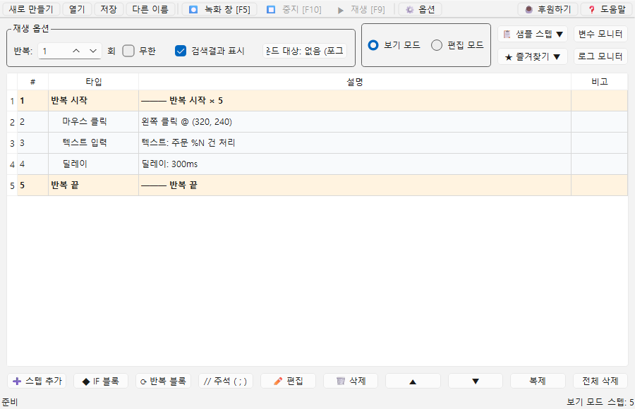

# [사용자 매뉴얼] 1. 기능설명: 코딩 없이 만드는 매크로 도구 한눈에 보기

## 기능설명

## 문서 이동

| 구분 | 문서 |
| --- | --- |
| 목록 | [[사용자 매뉴얼] 0. 목록](https://plcman.tistory.com/211) |
| 다음 | [[사용자 매뉴얼] 2. 기본 편집과 파일관리](https://plcman.tistory.com/215) |

**JP's Codeless Macro Tool**은 코딩 없이 마우스와 키보드 자동화 매크로를 만드는 Windows 포터블 도구입니다.
프로그래밍을 모르는 사람도 쓸 수 있는 무료 매크로이자 개인용 업무 자동화(RPA) 도구로, 설치 없이 실행 파일 하나로 바로 사용할 수 있습니다.

스텝을 하나씩 추가해 자동화 순서를 만들고, 필요한 경우 실제 동작을 녹화해서 스텝으로 변환할 수 있습니다.

## 주요 특징

- 설치 없이 exe 실행
- 실제 동작을 녹화해서 스텝으로 변환(클릭·키 입력·드래그 궤적과 이동 시간 포함)
- 마우스 이동, 클릭, 더블클릭, 드래그, 스크롤 지원
- 반복마다 다른 좌표를 사용하는 마우스 좌표 어레이 지원(기준좌표·간격·개수로 자동 생성, 실시간 미리보기)
- 키보드 단일 키와 조합키 입력 지원
- 한글을 포함한 긴 텍스트 자동 입력
- 주석 스텝으로 흐름에 설명 추가
- 보기 모드와 편집 모드로 실수 수정 방지
- 시간 대기와 클립보드 변경 대기 지원
- 이미지 인식으로 화면의 버튼이나 영역 찾기(여러 이미지 OR 검색 지원, 캡처 영역 이동·크기 조정과 확대 미리보기)
- 픽셀 색상, 이미지 유무, 소리 감지, 변수 비교 조건 지원
- 그리고(AND) / 또는(OR) / 아니면 만약(ELSE IF) / 아니면(ELSE) 분기와 조건 탈출(BREAK)로 다단계 조건 구성
- 반복 루프와 중첩 반복 지원
- 공통 스텝 묶음을 포인터로 저장해 여러 곳에서 재사용
- 변수 설정, 변수 계산, 텍스트 치환 지원 (선택형 변수 드롭박스로 값 빠르게 전환 지원)
- 정규식 추출로 문자열 일부를 변수에 저장
- 기본 제공 샘플 스텝 지원
- 사용자가 직접 저장하는 즐겨찾기 지원
- 전역 단축키로 실행/중지 가능
- 항상 위 옵션으로 매크로 실행 중에도 제어 창을 화면 앞에 고정
- 실행 중 변수값과 액션 로그를 실시간으로 보는 모니터 창

## 기본 사용 흐름

1. `JPsCodelessMacroTool.exe`를 실행합니다.
2. 프로젝트 이름을 만들거나 기존 프로젝트를 엽니다.
3. 스텝을 추가하거나 녹화로 동작을 가져옵니다.
4. 필요에 따라 조건, 반복 횟수, 변수, 정규식 추출, 이미지 검색을 설정합니다.
5. 저장한 뒤 실행 버튼 또는 단축키로 재생합니다.

<!--kage [##_Image|kage@trge5/dJMb99Nw80H/AAAAAAAAAAAAAAAAAAAAACwhnyTY7y5zI1a1tbtptZt1SJouuQjQZhFHMTV-KEBd/img.png?credential=yqXZFxpELC7KVnFOS48ylbz2pIh7yKj8&amp;expires=1782831599&amp;allow_ip=&amp;allow_referer=&amp;signature=pOm3n57Nrp54lH81klxJNsXP4y0%3D|CDM|1.3|{"originWidth":900,"originHeight":580,"style":"alignCenter"}_##]-->

## 실행 상태 모니터

매크로가 실행되는 동안 진행 상황을 실시간으로 확인할 수 있는 모니터 창 두 가지를 제공합니다.
우측 상단 버튼에서 켜고 끕니다.

- **변수 모니터**: 변수의 현재 값을 표로 보여줍니다.
- **로그 모니터**: 스텝별 실행 결과(예: 클릭 좌표, 입력한 텍스트, 조건 판정 결과)를 발생 시각과 함께 한 줄씩 보여줍니다.

두 창은 메인 창 오른쪽에 자석처럼 나란히 붙으며, 메인 창을 옮기거나 크기를 바꾸면 함께 따라옵니다.
필요하면 떼어내 자유롭게 배치할 수 있고, 로그 모니터는 크기를 늘려 긴 메시지를 좌우로 스크롤하며 볼 수 있습니다.

액션 로그는 화면뿐 아니라 실행 파일 옆 `logs` 폴더에도 저장됩니다. (옵션과 단축키 문서 참고)

## 이런 작업에 적합합니다

- 반복적인 사무 입력
- 같은 화면에서 반복 클릭이 필요한 작업
- 로딩 완료나 팝업 발생 여부를 보고 분기해야 하는 작업
- 버튼 위치가 바뀌어도 이미지로 찾아 클릭해야 하는 작업
- 반복마다 번호나 값을 조금씩 바꿔 입력해야 하는 작업
- 반복마다 클릭 좌표가 바뀌는 작업
- 복사한 내용이 준비된 뒤 다음 동작을 실행해야 하는 작업
- 화면이나 클립보드에서 얻은 문자열 중 필요한 값만 정규식으로 추출해야 하는 작업

## 사용 전 주의

이 프로그램은 실제 마우스와 키보드를 조작합니다.
실행 중에는 다른 작업을 방해할 수 있습니다.

> [!WARNING]
> 게임이나 일부 서비스는 매크로 사용을 금지할 수 있습니다.
> 사용 전에 각 서비스의 약관을 확인해야 합니다.

자동화 실행으로 생기는 결과는 사용자 본인의 책임입니다.

## 관련 문서

- 실제 마우스·키보드 동작을 녹화해 매크로로 만드는 방법은 [[사용자 매뉴얼] 3. 녹화와 재생](https://plcman.tistory.com/216) 문서에서 다룹니다.
- 화면 속 버튼을 이미지로 찾아 자동으로 클릭하려면 [[사용자 매뉴얼] 8. 이미지 검색과 캡처](https://plcman.tistory.com/221) 문서를 참고하세요.
- 프로그램 다운로드와 전체 기능 소개는 [JP's Codeless Macro Tool 다운로드·배포 안내](https://plcman.tistory.com/209)에서 볼 수 있습니다.
- 전체 매뉴얼 목차는 [[사용자 매뉴얼] 0. 목록](https://plcman.tistory.com/211)에서 볼 수 있습니다.

## 다음에 읽을 문서

- 다음: [[사용자 매뉴얼] 2. 기본 편집과 파일관리](https://plcman.tistory.com/215)
