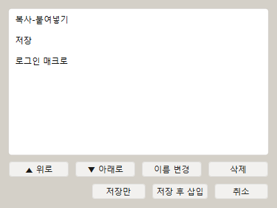

# [사용자 매뉴얼] 10. 즐겨찾기: 자주 쓰는 매크로 빠르게 실행하기

## 즐겨찾기

## 문서 이동

| 구분 | 문서 |
| --- | --- |
| 목록 | [[사용자 매뉴얼] 0. 목록](https://plcman.tistory.com/211) |
| 이전 | [[사용자 매뉴얼] 9. 옵션과 단축키](https://plcman.tistory.com/222) |
| 다음 | [[사용자 매뉴얼] 11. 정규식 추출](https://plcman.tistory.com/224) |

## 즐겨찾기란?

즐겨찾기는 자주 쓰는 스텝을 저장해 두고 필요할 때 빠르게 다시 추가하는 기능입니다.

반복해서 만드는 클릭, 딜레이, 텍스트 입력, 조건 스텝 등을 등록해 두면 작업 속도가 빨라집니다.

## 즐겨찾기 등록

자주 쓰는 스텝을 선택해 즐겨찾기에 등록할 수 있습니다.

등록할 때 이름을 지정하면 나중에 쉽게 찾을 수 있습니다.

## 즐겨찾기 사용

즐겨찾기에 등록된 항목은 메인 화면에서 선택해 현재 매크로에 추가할 수 있습니다.

드래그앤드롭으로 원하는 위치에 넣는 방식도 지원합니다.

## 즐겨찾기 관리

즐겨찾기 관리 창에서 등록된 항목을 확인하고 정리할 수 있습니다.

v1.0.15 이후 같은 이름으로 즐겨찾기를 추가할 때 중복을 확인하고, 덮어쓰기 또는 다시 입력을 선택할 수 있습니다.

<!--kage [##_Image|kage@cBCUVX/dJMcagML4iu/AAAAAAAAAAAAAAAAAAAAAPvCR5vr3aZZ0BTEW_5c0nylpCoq0t25PIUvfv7JFyIi/img.png?credential=yqXZFxpELC7KVnFOS48ylbz2pIh7yKj8&amp;expires=1782831599&amp;allow_ip=&amp;allow_referer=&amp;signature=kJOYLJb5zF1RkCdoQRW0oOF8ick%3D|CDM|1.3|{"originWidth":400,"originHeight":300,"style":"alignCenter"}_##]-->

## 샘플 스텝과의 차이

v1.0.23부터 기본 제공 예제는 즐겨찾기가 아니라 **샘플 스텝**으로 분리됩니다.

즐겨찾기는 사용자가 직접 저장하고 관리하는 개인 재사용 목록입니다.

처음 사용하는 경우에는 `샘플 스텝`에서 기본 예제를 먼저 삽입해 볼 수 있습니다.

## 저장 파일

즐겨찾기는 `favorites.json`에 저장됩니다.

다른 PC로 옮길 때 즐겨찾기도 함께 옮기려면 `favorites.json`을 같이 복사하면 됩니다.

## 활용 예

- 자주 쓰는 딜레이
- 특정 클릭 패턴
- 공통 텍스트 입력
- 팝업 닫기 조건
- 이미지 확인 후 클릭
- 반복 시작/끝 기본 묶음

## 구성 예시

예시: 업무 프로그램의 저장 단축키와 짧은 대기를 즐겨찾기로 만들기

1. 키보드 액션 스텝으로 `ctrl+s`를 추가합니다.
2. 딜레이 스텝을 추가하고 시간 대기를 `300ms` 정도로 설정합니다.
3. 두 스텝을 선택해 즐겨찾기에 `저장 후 짧은 대기` 같은 이름으로 등록합니다.
4. 다른 매크로에서도 저장이 필요한 위치에 이 즐겨찾기를 삽입합니다.

예시: 자주 뜨는 알림 닫기 흐름 저장

1. 이미지 조건 스텝으로 알림 창이 있는지 확인합니다.
2. 조건 안에 닫기 버튼 클릭 스텝을 넣습니다.
3. 조건 블록을 즐겨찾기에 등록합니다.
4. 긴 매크로의 중간중간 알림이 생길 수 있는 위치에 삽입합니다.

## 관련 문서

- 기본 제공 예제 스텝을 바로 넣으려면 [[사용자 매뉴얼] 12. 샘플 스텝](https://plcman.tistory.com/225) 문서를 참고하세요.
- 스텝을 추가·편집하는 기본 방법은 [[사용자 매뉴얼] 2. 기본 편집과 파일관리](https://plcman.tistory.com/215) 문서를 참고하세요.
- 프로그램 다운로드와 전체 기능 소개는 [JP's Codeless Macro Tool 다운로드·배포 안내](https://plcman.tistory.com/209)에서 볼 수 있습니다.
- 전체 매뉴얼 목차는 [[사용자 매뉴얼] 0. 목록](https://plcman.tistory.com/211)에서 볼 수 있습니다.

## 다음에 읽을 문서

- 이전: [[사용자 매뉴얼] 9. 옵션과 단축키](https://plcman.tistory.com/222)
- 다음: [[사용자 매뉴얼] 11. 정규식 추출](https://plcman.tistory.com/224)
