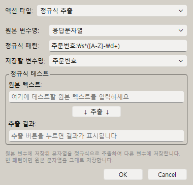

# [사용자 매뉴얼] 11. 정규식 추출: 정규식으로 텍스트 추출 자동화

## 정규식 추출

## 문서 이동

| 구분 | 문서 |
| --- | --- |
| 목록 | [[사용자 매뉴얼] 0. 목록](https://plcman.tistory.com/211) |
| 이전 | [[사용자 매뉴얼] 10. 즐겨찾기](https://plcman.tistory.com/223) |
| 다음 | [[사용자 매뉴얼] 12. 샘플 스텝](https://plcman.tistory.com/225) |
| 관련 | [[사용자 매뉴얼] 7. 변수와 연산](https://plcman.tistory.com/220) |

## 정규식 추출이란?

정규식 추출은 긴 문자열에서 필요한 부분만 골라 변수에 저장하는 기능입니다.

예를 들어 아래 문장에서 주문번호만 따로 쓰고 싶을 수 있습니다.

```text
주문번호: A-1024 / 금액: 35000원
```

이때 정규식 추출을 사용하면 `A-1024`만 뽑아 `주문번호` 변수에 저장할 수 있습니다.
저장된 변수는 이후 텍스트 입력, 조건 비교, 변수 계산에서 다시 사용할 수 있습니다.

## 언제 쓰나요?

정규식 추출은 아래처럼 일정한 형식의 글에서 일부 값만 가져올 때 유용합니다.

- 주문번호, 접수번호, 거래번호 추출
- 금액, 수량, 날짜 추출
- 로그 문장에서 오류 코드 추출
- 파일명이나 제목에서 번호만 추출
- 클립보드나 이전 스텝에서 저장한 문자열 중 필요한 부분만 재사용

정규식이 어렵게 느껴진다면 처음에는 “문장에서 필요한 값 앞뒤의 고정된 글자를 기준으로 찾는다”고 생각하면 됩니다.

## 기본 사용 흐름

1. 먼저 원본 문자열을 변수에 저장합니다.
2. 정규식 추출 스텝을 추가합니다.
3. 원본 변수명을 입력합니다.
4. 정규식 패턴을 입력합니다.
5. 추출 결과를 저장할 변수명을 입력합니다.
6. 테스트 영역에서 결과를 확인한 뒤 저장합니다.

원본 변수명과 저장할 변수명 입력 칸에는 일반 문자열과 `%변수명`을 모두 입력할 수 있습니다.
`%`를 입력하면 선언된 변수가 있을 때 변수 선택 팝업이 표시됩니다.
이 팝업은 입력을 돕는 기능이며, 사용자가 직접 입력한 문자열을 강제로 바꾸지는 않습니다.


<!--kage [##_Image|kage@Bj9W8/dJMcabYZaH2/AAAAAAAAAAAAAAAAAAAAAOfAUDEpHzx8LLemky_yNsDNGVoiZwEWM1hN6QOrKL6m/img.png?credential=yqXZFxpELC7KVnFOS48ylbz2pIh7yKj8&amp;expires=1782831599&amp;allow_ip=&amp;allow_referer=&amp;signature=hrV082ZFw4%2BYs1fBguiBKDgJX9Y%3D|CDM|1.3|{"originWidth":380,"originHeight":365,"style":"alignCenter"}_##]-->

## 가장 쉬운 예시

원본 변수 `문장`에 다음 값이 있다고 가정합니다.

```text
주문번호: A-1024 / 금액: 35000원
```

정규식 추출 스텝을 다음처럼 설정합니다.

| 항목 | 입력값 |
| --- | --- |
| 원본 변수명 | `문장` |
| 정규식 패턴 | `주문번호:\s*([A-Z]-\d+)` |
| 저장할 변수명 | `주문번호` |

실행 후 `주문번호` 변수에는 다음 값이 저장됩니다.

```text
A-1024
```

## 괄호가 중요한 이유

정규식에서 괄호 `()`는 “이 부분만 저장해 달라”는 뜻으로 사용됩니다.

패턴:

```text
금액:\s*(\d+)원
```

원본:

```text
금액: 35000원
```

저장 결과:

```text
35000
```

괄호가 없으면 매칭된 전체 문자열이 저장됩니다.
예를 들어 `금액:\s*\d+원`처럼 쓰면 `금액: 35000원` 전체가 저장됩니다.

## 자주 쓰는 패턴

| 찾고 싶은 값 | 패턴 예시 | 설명 |
| --- | --- | --- |
| 숫자 | `(\d+)` | 숫자 한 개 이상 |
| 영문자 | `([A-Za-z]+)` | 영문자 한 개 이상 |
| 한글 | `([가-힣]+)` | 한글 한 개 이상 |
| 공백 여러 개 | `\s*` | 공백이 없거나 여러 개 |
| 아무 글자 | `(.+)` | 줄 끝까지 넓게 매칭 |
| 날짜 | `(\d{4}-\d{2}-\d{2})` | `2026-05-14` 형식 |
| 코드 | `([A-Z]-\d+)` | `A-1024` 같은 형식 |

## 예시 1: 금액 추출

원본:

```text
결제금액: 48,500원
```

패턴:

```text
결제금액:\s*([\d,]+)원
```

결과:

```text
48,500
```

## 예시 2: 날짜 추출

원본:

```text
처리일: 2026-05-14 완료
```

패턴:

```text
처리일:\s*(\d{4}-\d{2}-\d{2})
```

결과:

```text
2026-05-14
```

## 예시 3: 오류 코드 추출

원본:

```text
ERROR [E-403] 권한이 없습니다.
```

패턴:

```text
\[([A-Z]-\d+)\]
```

결과:

```text
E-403
```

대괄호 `[`와 `]` 자체를 찾고 싶을 때는 `\[`처럼 앞에 역슬래시를 붙입니다.

## 예시 4: 파일명에서 번호 추출

원본:

```text
report_2026_001.xlsx
```

패턴:

```text
report_\d+_(\d+)\.xlsx
```

결과:

```text
001
```

점 `.`은 정규식에서 특별한 의미가 있으므로 실제 점을 찾을 때는 `\.`로 씁니다.

## 예시 5: 클립보드 복사값에서 전화번호 추출

웹 화면이나 메신저에서 아래처럼 한 줄을 복사했다고 가정합니다.

```text
담당자: 홍길동 / 연락처: 010-1234-5678 / 지역: 서울
```

패턴:

```text
연락처:\s*(\d{3}-\d{4}-\d{4})
```

결과:

```text
010-1234-5678
```

`010`, `1234`, `5678`처럼 자릿수가 정해져 있는 값은 `\d{3}`처럼 개수를 지정하면 실수를 줄일 수 있습니다.

## 예시 6: 날짜와 시간을 함께 추출

원본:

```text
예약일시: 2026-05-16 14:30 / 상태: 확정
```

패턴:

```text
예약일시:\s*(\d{4}-\d{2}-\d{2}\s+\d{2}:\d{2})
```

결과:

```text
2026-05-16 14:30
```

날짜와 시간 사이의 공백은 환경에 따라 한 칸 이상일 수 있으므로 `\s+`를 사용합니다.

## 예시 7: 제목에서 괄호 안 값 추출

원본:

```text
[긴급] 주문 확인 요청 (ORD-20260516-0042)
```

패턴:

```text
\((ORD-\d{8}-\d+)\)
```

결과:

```text
ORD-20260516-0042
```

괄호 문자 `(`, `)` 자체를 찾을 때는 `\(`, `\)`처럼 앞에 역슬래시를 붙입니다.

## 예시 8: 여러 값이 있는 문장에서 첫 번째 값만 추출

원본:

```text
상품: 키보드 / 수량: 2 / 단가: 35000원 / 합계: 70000원
```

수량만 저장하려면 수량 앞뒤의 고정 문구를 함께 씁니다.

패턴:

```text
수량:\s*(\d+)\s*/
```

결과:

```text
2
```

숫자만 찾는 `(\d+)`를 단독으로 쓰면 문장 안에서 가장 먼저 나오는 숫자를 잡을 수 있습니다.
원하는 값 앞의 고정 문구를 같이 쓰는 것이 안전합니다.

## 예시 9: 공백이 일정하지 않은 문장 처리

원본:

```text
접수번호   :    CS-7788
```

패턴:

```text
접수번호\s*:\s*([A-Z]+-\d+)
```

결과:

```text
CS-7788
```

입력 화면이나 복사한 텍스트는 공백이 일정하지 않을 수 있습니다. 고정 문구와 값 사이에는 `\s*`를 넣어 두면 실패 가능성을 줄일 수 있습니다.

## 예시 10: 줄바꿈이 있는 텍스트에서 값 추출

원본:

```text
주문번호: A-1024
결제금액: 35000원
상태: 완료
```

패턴:

```text
결제금액:\s*([\d,]+)원
```

결과:

```text
35000
```

여러 줄 텍스트라도 찾고 싶은 줄에 고정 문구가 있으면 같은 방식으로 추출할 수 있습니다.

## 패턴 선택 빠른 기준

| 상황 | 추천 패턴 형태 | 이유 |
| --- | --- | --- |
| 앞뒤 문구가 고정됨 | `앞문구\s*(.+?)\s*뒤문구` | 필요한 구간만 좁게 추출 |
| 숫자만 필요함 | `(\d+)` | 쉼표 없는 숫자 추출 |
| 금액에 쉼표가 있음 | `([\d,]+)` | `48,500` 같은 값 유지 |
| 코드 형식이 정해짐 | `([A-Z]+-\d+)` | 영문 코드와 숫자 조합 추출 |
| 공백이 들쭉날쭉함 | `\s*` 또는 `\s+` | 복사한 텍스트의 공백 차이 대응 |
| 특수 문자를 찾아야 함 | `\[` `\.` `\(` | 정규식 기호가 아닌 실제 문자로 처리 |

## 저장 규칙

정규식 추출 스텝은 다음 규칙으로 결과를 저장합니다.

- 괄호로 묶은 캡처 그룹이 있으면 첫 번째 그룹 값이 저장됩니다.
- 캡처 그룹이 없으면 매칭된 전체 문자열이 저장됩니다.
- 패턴이 비어 있으면 원본 문자열 전체가 저장됩니다.
- 매칭에 실패하면 빈 문자열이 저장됩니다.
- 정규식 오류가 있어도 매크로 실행은 중단되지 않고 빈 문자열이 저장됩니다.

## 테스트 기능 사용

정규식 추출 스텝 편집 화면에는 테스트 영역이 있습니다.

1. 원본 텍스트에 실제 예시 문장을 넣습니다.
2. 정규식 패턴을 입력합니다.
3. 추출 버튼을 누릅니다.
4. 추출 결과가 원하는 값인지 확인합니다.

> [!TIP]
> 정규식은 작은 오타에도 결과가 달라질 수 있으므로, 저장 전에 테스트 기능으로 확인하는 것을 권장합니다.

## 잘 안 될 때 확인할 것

- 원본 변수명과 저장할 변수명이 서로 다른지 확인합니다.
- 원본 변수에 실제 문자열이 들어 있는지 변수 모니터에서 확인합니다.
- 필요한 부분을 괄호 `()`로 묶었는지 확인합니다.
- 공백이 있을 수 있다면 `\s*`를 사용합니다.
- 점, 대괄호, 괄호 같은 특수 문자를 실제 글자로 찾을 때는 앞에 `\`를 붙입니다.
- 너무 넓은 패턴 `(.+)`은 원하지 않는 부분까지 잡을 수 있으므로 가능한 앞뒤 고정 문구를 함께 씁니다.

## 추천 작성 방식

처음부터 복잡한 정규식을 만들지 말고 아래 순서로 작성하는 것이 좋습니다.

1. 원본 문장에서 항상 고정되는 앞부분을 적습니다.
2. 추출할 부분을 괄호로 묶습니다.
3. 추출할 부분 뒤에 항상 나오는 글자를 적습니다.
4. 테스트 기능으로 결과를 확인합니다.

예:

```text
주문번호:\s*(.+?)\s*/
```

이 패턴은 `주문번호:` 뒤부터 `/` 앞까지의 값을 추출합니다.

## 관련 문서

- 추출한 값을 변수로 저장해 다시 쓰려면 [[사용자 매뉴얼] 7. 변수와 연산](https://plcman.tistory.com/220) 문서를 참고하세요.
- 추출 결과에 따라 분기하려면 [[사용자 매뉴얼] 4. 조건](https://plcman.tistory.com/217) 문서를 참고하세요.
- 프로그램 다운로드와 전체 기능 소개는 [JP's Codeless Macro Tool 다운로드·배포 안내](https://plcman.tistory.com/209)에서 볼 수 있습니다.
- 전체 매뉴얼 목차는 [[사용자 매뉴얼] 0. 목록](https://plcman.tistory.com/211)에서 볼 수 있습니다.

## 다음에 읽을 문서

- 이전: [[사용자 매뉴얼] 10. 즐겨찾기](https://plcman.tistory.com/223)
- 다음: [[사용자 매뉴얼] 12. 샘플 스텝](https://plcman.tistory.com/225)
