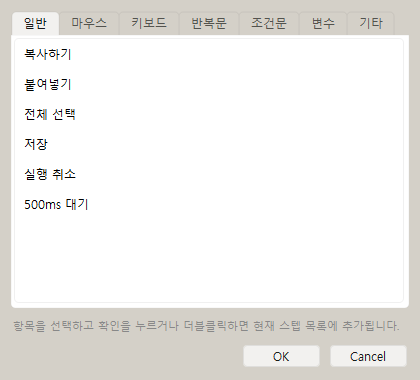
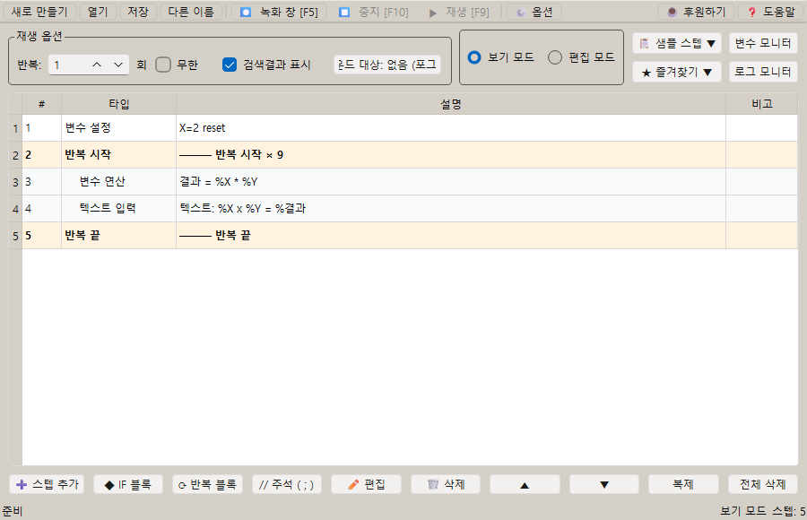

# [사용자 매뉴얼] 12. 샘플 스텝: 미리 만든 매크로 예제 가져오기

## 샘플 스텝

## 문서 이동

| 구분 | 문서 |
| --- | --- |
| 목록 | [[사용자 매뉴얼] 0. 목록](https://plcman.tistory.com/211) |
| 이전 | [[사용자 매뉴얼] 11. 정규식 추출](https://plcman.tistory.com/224) |
| 다음 | [[사용자 매뉴얼] 13. OCR 텍스트 읽기](https://plcman.tistory.com/234) |

## 샘플 스텝이란?

샘플 스텝은 프로그램이 기본 제공하는 읽기 전용 예제 스텝 목록입니다.

복사, 붙여넣기, 반복문, 조건문, 변수, 주석처럼 자주 쓰는 기본 구성을 바로 삽입해 매크로 작성 흐름을 익힐 수 있습니다.

## 즐겨찾기와의 차이

샘플 스텝은 사용자가 추가, 수정, 삭제할 수 없습니다.

즐겨찾기는 사용자가 직접 선택한 스텝을 저장해 다시 사용하는 개인 목록입니다.

v1.0.23부터 새 사용자에게는 기본 즐겨찾기가 자동 생성되지 않으며, 기본 예제는 샘플 스텝에서 제공합니다.

## 사용 방법

1. 메인 화면 상단의 `샘플 스텝` 버튼을 누릅니다.
2. 일반, 마우스, 키보드, 반복문, 조건문, 변수, 기타 탭 중 필요한 분류를 선택합니다.
3. 항목을 선택하고 확인을 누르거나 항목을 더블클릭합니다.
4. 현재 선택된 행 아래에 샘플 스텝이 삽입됩니다.

선택된 행이 없으면 스텝 목록의 맨 아래에 추가됩니다.

<!--kage [##_Image|kage@9jAjF/dJMcahkCjXq/AAAAAAAAAAAAAAAAAAAAAKFKgf4ChzQW63l07qkYz-Bo_Q3vSazJwsJfn2Va48LM/img.png?credential=yqXZFxpELC7KVnFOS48ylbz2pIh7yKj8&amp;expires=1782831599&amp;allow_ip=&amp;allow_referer=&amp;signature=FCzd0DJ9AY2u7EyJMp4ipu%2FW3fQ%3D|CDM|1.3|{"originWidth":420,"originHeight":380,"style":"alignCenter"}_##]-->

## 제공 분류

| 분류 | 예 |
| --- | --- |
| 일반 | 복사하기, 붙여넣기, 전체 선택, 저장, 실행 취소, 500ms 대기 |
| 마우스 | 마우스 이동 체험, 마우스 클릭 준비, 마우스 스크롤 체험 |
| 키보드 | 단일 키 입력, 조합키 입력, 키 누름/뗌, 텍스트 입력과 대기 |
| 반복문 | 3회 반복 기본 블록, 구구단 예제 |
| 조건문 | 이미지 있으면/없으면 분기, A AND B, A OR B, A OR B ELSE, (A AND B) OR C, A ELSE IF B, 3단계 분기 (A ELSE IF B ELSE), 반복 안 BREAK 탈출 |
| 변수 | 카운터 변수 만들기 |
| 기타 | 주석 스텝 예제 |

## 사용 예시

예시: 반복문 샘플로 기본 구조 만들기

1. 샘플 스텝에서 `반복문` 분류를 선택합니다.
2. `3회 반복 기본 블록`을 삽입합니다.
3. 반복 시작과 반복 끝 사이에 클릭, 텍스트 입력, 딜레이 같은 실제 작업 스텝을 넣습니다.
4. 필요한 반복 횟수로 수정합니다.

예시: 구구단 예제로 중첩 반복과 변수 계산 확인하기

1. 샘플 스텝에서 `반복문` 분류를 선택합니다.
2. `구구단 예제`를 삽입합니다.
3. 메모장 같은 텍스트 입력 위치를 선택합니다.
4. 실행하면 2단부터 9단까지 `%X x %Y = %결과` 형식으로 출력됩니다.

예시: 변수 샘플로 카운터 만들기

1. 샘플 스텝에서 `변수` 분류를 선택합니다.
2. 카운터 변수 샘플을 삽입합니다.
3. 변수명과 초기값을 업무에 맞게 바꿉니다.
4. 텍스트 입력이나 변수 계산 스텝과 연결해 반복마다 다른 값을 입력합니다.

예시: 조건문 샘플로 이미지 분기 만들기

1. 샘플 스텝에서 `조건문` 분류를 선택합니다.
2. 사용 목적에 맞는 예제를 선택합니다.

| 예제 | 언제 쓰나 |
| --- | --- |
| 이미지 있으면/없으면 분기 | 이미지가 발견되면 A, 없으면 B를 실행하고 싶을 때 |
| 두 이미지 모두 있을 때 (A AND B) | 두 이미지가 동시에 화면에 있을 때만 실행하고 싶을 때 |
| 둘 중 하나 있을 때 (A OR B) | 두 이미지 중 하나라도 발견되면 같은 동작을 실행하고 싶을 때 |
| 다중 이미지 분기 (A OR B ELSE) | A 또는 B 중 하나라도 발견되면 공통 처리를 하고, 둘 다 없으면 기본 처리를 하고 싶을 때 |
| 복합 조건 (A AND B) OR C | A·B가 동시에 있거나, C가 있으면 실행하고 싶을 때 |
| 순차 분기 (A ELSE IF B) | A가 아니면 B를 순서대로 확인하고 싶을 때 |
| 3단계 분기 (A ELSE IF B ELSE) | A → B → 기본 처리 순서로 분기하고 싶을 때 |

3. 삽입 후 각 조건의 이미지 스텝을 더블클릭해 비교할 이미지를 설정합니다.
4. 실행할 작업을 조건 블록 안에 추가합니다.

AND 체인을 사용할 때는 실행할 스텝을 **마지막 조건 IF 블록 안**에 넣어야 합니다. 첫 번째 조건 IF 안에 실행 스텝을 넣으면 해당 스텝은 무시됩니다.

예시: 아니면 만약(ELSE IF) 샘플로 순차 분기 만들기

1. 샘플 스텝에서 `조건문` 분류를 선택합니다.
2. `순차 분기 (A ELSE IF B)` 또는 `3단계 분기 (A ELSE IF B ELSE)`를 삽입합니다.

| 예제 | 평가 순서 | 언제 쓰나 |
| --- | --- | --- |
| 순차 분기 (A ELSE IF B) | A 참 → A 실행, A 거짓이면 B 확인 | 두 가지 상태를 순서대로 구분하고 싶을 때 |
| 3단계 분기 (A ELSE IF B ELSE) | A → B → 기본 순서로 평가 | 성공·경고·기타처럼 3단계 결과를 분기하고 싶을 때 |

3. 삽입 후 각 조건의 이미지 스텝을 더블클릭해 비교 이미지를 설정합니다.
4. 각 조건 블록 안에 실행할 작업을 추가합니다.

또는(OR)와의 차이: ELSE IF는 앞 조건이 **거짓일 때만** 다음 조건을 확인하고 **조건마다 다른 스텝을 실행**합니다.
OR은 여러 조건 중 하나라도 참이면 **공통 스텝을 실행**합니다.
자세한 설명은 [[사용자 매뉴얼] 4. 조건](https://plcman.tistory.com/217)을 참고하세요.

예시: BREAK 샘플로 반복 안에서 조건 탈출 만들기

1. 샘플 스텝에서 `조건문` 분류를 선택합니다.
2. `반복 안 BREAK 탈출`을 삽입합니다.
3. 내부 조건의 이미지 스텝을 더블클릭해 탈출 조건을 설정합니다.
4. BREAK 위에 탈출 전 처리할 스텝을 추가합니다.

BREAK가 실행되면 현재 반복 회차의 나머지 조건 블록을 모두 건너뛰고 다음 반복으로 이어집니다.
자세한 설명은 [[사용자 매뉴얼] 4. 조건](https://plcman.tistory.com/217)의 조건 탈출(BREAK) 섹션을 참고하세요.

<!--kage [##_Image|kage@bAO7Qa/dJMcaiXZDOT/AAAAAAAAAAAAAAAAAAAAAG9SoFQVJgloU97N_OXVshC7h78Zt4MKKDOEF8sjA-cM/img.png?credential=yqXZFxpELC7KVnFOS48ylbz2pIh7yKj8&amp;expires=1782831599&amp;allow_ip=&amp;allow_referer=&amp;signature=IckFqgmGZLoAtBJyT0N2xKzcd6Y%3D|CDM|1.3|{"originWidth":900,"originHeight":580,"style":"alignCenter"}_##]-->

## 주의사항

- 샘플 스텝은 읽기 전용입니다.
- 실행 중에는 샘플 스텝을 삽입할 수 없습니다.
- 삽입된 뒤에는 일반 스텝과 동일하게 편집할 수 있습니다.
- 마우스 샘플은 기본 상태에서 실제 클릭을 실행하지 않고, 안전한 이동/주석/대기 중심으로 구성되어 있습니다.
- 구구단 예제는 텍스트 입력 스텝을 실행하므로, 실행 전 출력 대상 입력 위치를 먼저 선택해야 합니다.
- 기존 사용자의 `favorites.json`에 저장된 즐겨찾기는 그대로 유지됩니다.

## 관련 문서

- 조건 분기 예제의 자세한 설명은 [[사용자 매뉴얼] 4. 조건](https://plcman.tistory.com/217) 문서를 참고하세요.
- 자주 쓰는 스텝을 직접 저장해 재사용하려면 [[사용자 매뉴얼] 10. 즐겨찾기](https://plcman.tistory.com/223) 문서를 참고하세요.
- 프로그램 다운로드와 전체 기능 소개는 [JP's Codeless Macro Tool 다운로드·배포 안내](https://plcman.tistory.com/209)에서 볼 수 있습니다.
- 전체 매뉴얼 목차는 [[사용자 매뉴얼] 0. 목록](https://plcman.tistory.com/211)에서 볼 수 있습니다.

## 다음에 읽을 문서

- 이전: [[사용자 매뉴얼] 11. 정규식 추출](https://plcman.tistory.com/224)
- 다음: [[사용자 매뉴얼] 13. OCR 텍스트 읽기](https://plcman.tistory.com/234)
