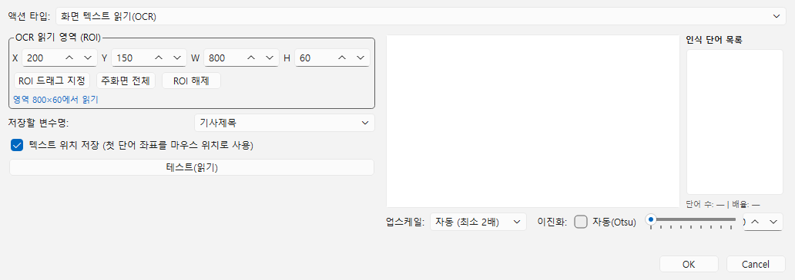
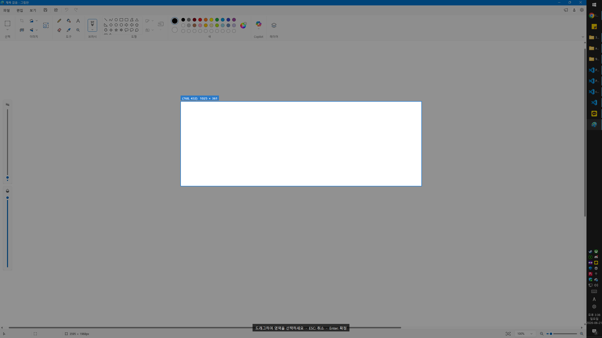
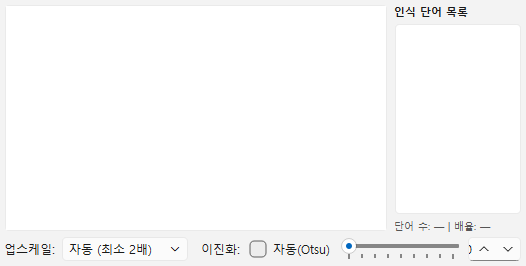
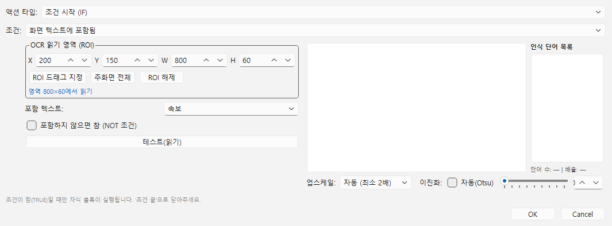
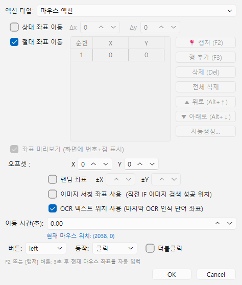

# [사용자 매뉴얼] 13. OCR 텍스트 읽기: 화면 글자를 읽어 변수에 저장하기

## OCR 텍스트 읽기

## 문서 이동

| 구분 | 문서 |
| --- | --- |
| 목록 | [[사용자 매뉴얼] 0. 목록](https://plcman.tistory.com/211) |
| 이전 | [[사용자 매뉴얼] 12. 샘플 스텝](https://plcman.tistory.com/225) |
| 다음 | [[사용자 매뉴얼] 14. 백그라운드 입력](https://plcman.tistory.com/240) |

## OCR 텍스트 읽기란?

OCR 텍스트 읽기 기능은 화면의 지정된 영역에서 텍스트를 자동으로 인식해 변수에 저장하거나, 특정 단어가 포함됐는지를 조건으로 판단하는 기능입니다.

재고 수량, 처리 상태 메시지, 버튼 레이블처럼 화면에 표시되는 텍스트를 매크로가 직접 읽어 이후 동작의 기준으로 활용할 수 있습니다.

대표 사용 예:

- 재고 숫자를 읽어 변수에 저장한 뒤, 해당 숫자가 0이면 발주 버튼을 누른다.
- "처리 완료" 메시지가 화면에 보일 때만 다음 단계로 진행한다.
- 오류 텍스트가 나타나면 재시도 동작을 실행한다.
- OCR로 인식한 특정 단어 위치를 클릭한다.

## OCR 기능 사용 전 확인 사항 (ko-KR 언어팩)

OCR 기능은 Windows에 기본 내장된 인식 엔진(WinRT Windows.Media.Ocr)을 사용합니다.
이 엔진이 동작하려면 Windows에 **한국어(ko-KR) 언어팩**이 설치되어 있어야 합니다.

언어팩이 설치되지 않은 PC에서는 OCR 관련 스텝과 조건이 비활성화되고, 편집 화면에 설치 안내 메시지가 표시됩니다.

### ko-KR 언어팩 설치 방법

1. Windows 설정을 엽니다 (시작 메뉴 → 설정, 또는 `Win + I`).
2. **시간 및 언어** → **언어 및 지역**을 선택합니다.
3. **언어 추가** 버튼을 클릭합니다.
4. 검색창에 `한국어`를 입력하고 **한국어(대한민국)** 를 선택합니다.
5. 설치 옵션에서 **기본 입력 방법 설치** 또는 **언어팩 설치**를 선택하고 설치를 완료합니다.
6. 설치 후 JP's Codeless Macro Tool을 재시작합니다.

> [!NOTE]
> 영어 전용 Windows 환경에서도 한국어 언어팩만 추가하면 OCR 기능이 활성화됩니다. 기본 표시 언어를 바꿀 필요는 없습니다.

## OCR_READ 스텝: 화면 텍스트를 변수에 저장하기

`OCR 텍스트 읽기` 스텝은 지정한 영역의 화면을 캡처해 텍스트를 인식하고, 결과를 지정한 변수에 저장합니다.

### 이 기능이 필요한 상황

- 화면에 표시되는 숫자나 상태 문자열을 변수에 넣어 이후 스텝에서 활용할 때
- 읽은 텍스트에서 특정 값만 추출(정규식 추출과 조합)하고 싶을 때
- 인식된 단어의 위치를 기준으로 클릭하고 싶을 때

### 스텝 추가 방법

1. 스텝 목록에서 원하는 위치에 커서를 둡니다.
2. 스텝 추가 메뉴에서 **OCR 텍스트 읽기**를 선택합니다.
3. 스텝 편집 창이 열립니다.


<!--kage [##_Image|kage@GWNOa/dJMcabECpdq/AAAAAAAAAAAAAAAAAAAAABbIwrQqNoq9Hn3AiiJUZ2nP82zE2v3ICGxsC0TU41sC/img.png?credential=yqXZFxpELC7KVnFOS48ylbz2pIh7yKj8&amp;expires=1782831599&amp;allow_ip=&amp;allow_referer=&amp;signature=RA73ygQ6cqEPgDX5tK%2BAPPzHgIs%3D|CDM|1.3|{"originWidth":1032,"originHeight":365,"style":"alignCenter"}_##]-->

### 항목별 설명

| 항목 | 설명 |
| --- | --- |
| **읽기 영역 (ROI)** | 텍스트를 인식할 화면 영역입니다. 드래그로 직접 지정합니다. 설정하지 않으면 전체 화면을 대상으로 합니다. |
| **저장할 변수** | 인식된 텍스트를 저장할 변수 이름입니다. 기존 변수를 선택하거나 새 이름을 입력합니다. |
| **텍스트 위치 저장** | 체크하면 인식된 첫 번째 단어의 화면 좌표가 저장됩니다. 이후 마우스 스텝에서 해당 위치를 클릭 대상으로 사용할 수 있습니다. |
| **테스트(읽기) 버튼** | 현재 화면에서 즉시 인식을 수행하고 결과를 미리보기 창에 표시합니다. 스텝을 저장하기 전에 인식이 잘 되는지 확인할 때 사용합니다. |

### ROI 영역 지정 방법

1. **영역 지정** 버튼을 클릭하면 화면 캡처 모드로 전환됩니다.
2. 마우스를 끌어 텍스트가 있는 영역을 선택합니다.
3. 너무 넓게 잡으면 불필요한 텍스트까지 인식될 수 있으니, 읽으려는 부분만 잡는 것이 좋습니다.
4. 선택이 완료되면 편집 창으로 돌아옵니다.


<!--kage [##_Image|kage@u8Scv/dJMcajvUuHD/AAAAAAAAAAAAAAAAAAAAADtHAVuGp06_aJNxftVMSoxmiWLqfuVFjOLLUp8FNs9R/img.png?credential=yqXZFxpELC7KVnFOS48ylbz2pIh7yKj8&amp;expires=1782831599&amp;allow_ip=&amp;allow_referer=&amp;signature=pJPaA5OeQASxWhcDki5ZmxOGh94%3D|CDM|1.3|{"originWidth":2560,"originHeight":1440,"style":"alignCenter"}_##]-->

### OCR 미리보기 창 사용법 (테스트 버튼)

**테스트(읽기)** 버튼을 누르면 미리보기 창이 열립니다.


<!--kage [##_Image|kage@zA5Ig/dJMb997SC20/AAAAAAAAAAAAAAAAAAAAAJXPhI0uTEf-6UcjZ-1zWdfgXbY_cVV5x4buYb7ym-Ws/img.png?credential=yqXZFxpELC7KVnFOS48ylbz2pIh7yKj8&amp;expires=1782831599&amp;allow_ip=&amp;allow_referer=&amp;signature=pf6lspGLxyqMgXPs9fAiRNskHRg%3D|CDM|1.3|{"originWidth":526,"originHeight":266,"style":"alignCenter"}_##]-->

미리보기 창에서는 다음을 조정할 수 있습니다.

| 컨트롤 | 설명 |
| --- | --- |
| **업스케일 배율** | 인식 전 이미지를 확대하는 비율입니다. 작은 폰트나 저해상도 화면의 인식률을 높이려면 배율을 높여 보세요 (2~5배 선택 가능). |
| **이진화: 자동(Otsu)** | 이미지를 흑백으로 변환할 때 밝기 경계를 자동으로 계산합니다. 대부분의 경우 이 설정으로 충분합니다. |
| **이진화: 수동** | 수동 모드에서는 슬라이더로 밝기 경계를 직접 조정합니다. 배경과 글자 색의 대비가 낮을 때 유용합니다. |
| **미리보기** | 현재 설정으로 전처리된 이미지와 인식 결과를 미리 확인합니다. 빨간 박스로 인식된 단어 위치가 표시됩니다. |

> [!TIP]
> 작은 글자나 숫자 인식이 잘 안 되면 업스케일 배율을 2 이상으로 높여 보세요. 배율이 높을수록 처리 시간은 조금 늘어날 수 있습니다.

### 실전 예시: 재고 수량 읽기

**상황**: 프로그램 화면에 재고 수량이 표시되어 있고, 이 숫자를 변수에 저장해 이후 조건 분기에서 사용한다.

1. `OCR 텍스트 읽기` 스텝을 추가합니다.
2. 재고 수량이 표시되는 영역을 ROI로 지정합니다.
3. **저장할 변수**에 `재고수량`을 입력합니다.
4. **테스트(읽기)** 버튼으로 인식 결과가 올바른지 확인합니다.
5. 스텝을 저장합니다.

재생 후 변수 모니터에서 `재고수량` 변수에 화면에 표시된 숫자 텍스트가 저장됩니다.

## text_contains 조건: 텍스트 포함 여부로 분기하기

`화면 텍스트 포함` 조건은 지정한 영역에서 OCR로 읽은 텍스트에 특정 단어가 포함됐는지 판단합니다.

### 이 기능이 필요한 상황

- "처리 완료", "오류" 같은 상태 메시지가 화면에 나타날 때만 다음 동작을 실행하고 싶을 때
- 특정 단어가 **없을** 때 다른 처리를 하고 싶을 때

### 조건 추가 방법

1. 스텝 목록에서 조건을 추가할 위치에 커서를 둡니다.
2. 스텝 추가 메뉴에서 **조건 시작**을 추가합니다.
3. 조건 종류를 **화면 텍스트 포함**으로 선택합니다.
4. 편집 창에서 ROI 영역과 판단할 키워드를 입력합니다.


<!--kage [##_Image|kage@dH1ECa/dJMcabR8dQF/AAAAAAAAAAAAAAAAAAAAAAxyaZal4zBI-RiahnI6DF8AxcHYDkUx_BHnFKPEz73V/img.png?credential=yqXZFxpELC7KVnFOS48ylbz2pIh7yKj8&amp;expires=1782831599&amp;allow_ip=&amp;allow_referer=&amp;signature=HIEmzeA7qBi8TKDYNmlDG6t%2BH7g%3D|CDM|1.3|{"originWidth":1065,"originHeight":395,"style":"alignCenter"}_##]-->

### 항목별 설명

| 항목 | 설명 |
| --- | --- |
| **읽기 영역 (ROI)** | 텍스트를 인식할 화면 영역입니다. 드래그로 지정합니다. |
| **키워드** | 포함 여부를 확인할 단어나 문자열입니다. |
| **포함하지 않음** | 체크하면 "키워드가 없을 때" 조건이 참이 됩니다. |
| **테스트 버튼** | 현재 화면에서 즉시 인식해 키워드가 포함됐는지 확인합니다. |

### 실전 예시: "처리 완료" 메시지가 보일 때 다음 단계 실행

```
조건 시작 (화면 텍스트 포함: "완료")
  다음 버튼 클릭
조건 끝
```

1. `조건 시작` 스텝을 추가하고 조건 종류를 **화면 텍스트 포함**으로 선택합니다.
2. ROI를 상태 메시지가 나타나는 영역으로 지정합니다.
3. 키워드에 `완료`를 입력합니다.
4. 조건 안에 다음 버튼 클릭 스텝을 넣습니다.
5. 조건 끝 스텝을 추가합니다.

### 실전 예시: 오류 메시지가 없을 때만 저장 실행

```
조건 시작 (화면 텍스트 포함하지 않음: "오류")
  저장 버튼 클릭
조건 끝
```

조건 편집 창에서 키워드에 `오류`를 입력하고 **포함하지 않음** 체크박스를 켭니다.

> [!NOTE]
> `화면 텍스트 포함` 조건은 완전 일치가 아니라 **부분 포함**을 판단합니다. "처리 완료"가 화면에 있으면 키워드 "완료"로도 조건이 참이 됩니다.

## use_text_pos: OCR 인식 단어 위치 클릭하기

OCR로 텍스트를 읽을 때 인식된 단어의 화면 좌표를 마우스 스텝에서 클릭 위치로 사용할 수 있습니다.

### 이 기능이 필요한 상황

- 버튼 레이블이나 항목 텍스트가 매번 다른 위치에 나타날 때
- 텍스트가 있는 정확한 위치를 고정 좌표 없이 클릭하고 싶을 때

### 사용 방법

1. `OCR 텍스트 읽기` 스텝에서 **텍스트 위치 저장** 옵션을 켭니다.
2. 이후에 마우스 스텝(클릭, 이동 등)을 추가합니다.
3. 마우스 스텝 편집 창에서 **텍스트 OCR 위치 사용** 옵션을 켭니다.
4. 재생 시 OCR로 인식된 첫 번째 단어의 중심 좌표로 마우스가 이동하거나 클릭합니다.


<!--kage [##_Image|kage@c54WKY/dJMcabYZaLu/AAAAAAAAAAAAAAAAAAAAAHSpEjs_eu4etbbaRJOjxKpi8tjbP0mjII5t2tJLgo72/img.png?credential=yqXZFxpELC7KVnFOS48ylbz2pIh7yKj8&amp;expires=1782831599&amp;allow_ip=&amp;allow_referer=&amp;signature=Q0OUk3JWnzFUjzmdL0EiM9iJsdQ%3D|CDM|1.3|{"originWidth":474,"originHeight":558,"style":"alignCenter"}_##]-->

### 실전 예시: 인식된 단어 클릭

```
OCR 텍스트 읽기 (ROI 지정, 변수: 결과텍스트, 텍스트 위치 저장: 켬)
마우스 클릭 (텍스트 OCR 위치 사용: 켬)
```

> [!NOTE]
> **텍스트 OCR 위치 사용**은 바로 앞 `OCR 텍스트 읽기` 스텝이 성공해 인식된 단어 좌표가 있을 때만 동작합니다. 인식 결과가 없으면 해당 마우스 스텝은 건너뛰고 매크로는 계속 진행합니다.

이미지 위치 기준 클릭(`use_image_pos`)과 사용 방식이 동일합니다. 두 옵션을 혼용할 수 있으며, 텍스트 위치 사용을 켜면 이미지 위치 사용보다 우선합니다.

## 숫자 추출 예시: OCR_READ + 정규식 추출 조합

화면에서 읽은 텍스트에서 숫자만 추출하려면 **정규식 추출** 스텝을 함께 사용합니다.

### 상황

재고 화면에 "현재 재고: 42개"라는 텍스트가 표시되고 있습니다. 이 중 숫자 `42`만 꺼내 변수에 저장한 뒤 조건 분기에 활용합니다.

### 스텝 구성

```
OCR 텍스트 읽기 (ROI: 재고 표시 영역, 변수: 재고원문)
정규식 추출 (소스 변수: 재고원문, 패턴: \d+, 저장 변수: 재고수량)
조건 시작 (변수 값 비교: 재고수량 == 0)
  발주 버튼 클릭
조건 끝
```

1. `OCR 텍스트 읽기` 스텝으로 재고 문구를 `재고원문` 변수에 저장합니다.
2. `정규식 추출` 스텝에서 패턴 `\d+`(하나 이상의 숫자)로 `재고원문`에서 숫자만 추출해 `재고수량` 변수에 저장합니다.
3. `변수 값 비교` 조건으로 `재고수량`이 0이면 발주 버튼을 클릭합니다.

정규식 추출 사용 방법은 [[사용자 매뉴얼] 11. 정규식 추출](https://plcman.tistory.com/224) 문서를 참고하세요.

## 주의사항

### 완전일치 비교는 사용하지 마세요

OCR 인식 결과는 폰트, 해상도, 화면 상태에 따라 문자 하나가 다르게 읽힐 수 있습니다.
"완료"가 "완료."처럼 마침표가 붙어 인식되는 경우도 있습니다.

이 때문에 `화면 텍스트 포함` 조건만 제공하며, 완전일치 비교는 지원하지 않습니다.

- 변수에 저장된 OCR 결과를 `변수 값 비교 == "처리 완료"`처럼 완전일치로 비교하면 오인식 시 조건이 실패합니다.
- `화면 텍스트 포함` 조건이나 `정규식 추출` 후 처리를 권장합니다.


### 짧은 단어는 인식률이 낮을 수 있습니다

2자 이하의 짧은 한글 단어(예: "완", "중")는 인식이 불안정할 수 있습니다.
가능하면 3자 이상의 구체적인 단어(예: "처리완료", "진행중")를 키워드로 사용하세요.

### 작은 폰트는 업스케일을 사용하세요

폰트 크기가 작거나 화면 해상도가 낮으면 인식률이 떨어질 수 있습니다.
테스트 버튼으로 미리보기를 확인하고, 인식이 잘 안 되면 업스케일 배율을 2 이상으로 높여 보세요.

### ROI는 좁게 잡을수록 안정적입니다

ROI 영역이 넓으면 화면의 다른 텍스트까지 함께 인식되어 원하는 결과를 얻기 어려울 수 있습니다.
읽으려는 텍스트 주변만 좁게 지정하세요.

### ko-KR 언어팩이 없으면 비활성화됩니다

OCR 스텝과 조건이 회색으로 비활성화되어 있으면 ko-KR 언어팩이 설치되지 않은 것입니다. 이 문서 상단의 설치 방법을 따라 언어팩을 추가하세요.

## 관련 문서

- OCR로 읽은 숫자나 문자열에서 일부 값만 추출하려면 [[사용자 매뉴얼] 11. 정규식 추출](https://plcman.tistory.com/224) 문서를 참고하세요.
- 화면 이미지를 기준으로 조건 분기하거나 클릭하려면 [[사용자 매뉴얼] 8. 이미지 검색과 캡처](https://plcman.tistory.com/221) 문서를 참고하세요.
- 변수를 활용한 조건 분기는 [[사용자 매뉴얼] 4. 조건](https://plcman.tistory.com/217) 문서를 참고하세요.
- 변수 설정과 연산은 [[사용자 매뉴얼] 7. 변수와 연산](https://plcman.tistory.com/220) 문서를 참고하세요.
- 프로그램 다운로드와 전체 기능 소개는 [JP's Codeless Macro Tool 다운로드·배포 안내](https://plcman.tistory.com/209)에서 볼 수 있습니다.
- 전체 매뉴얼 목차는 [[사용자 매뉴얼] 0. 목록](https://plcman.tistory.com/211)에서 볼 수 있습니다.

## 다음에 읽을 문서

- 이전: [[사용자 매뉴얼] 12. 샘플 스텝](https://plcman.tistory.com/225)
- 다음: [[사용자 매뉴얼] 14. 백그라운드 입력](https://plcman.tistory.com/240)
