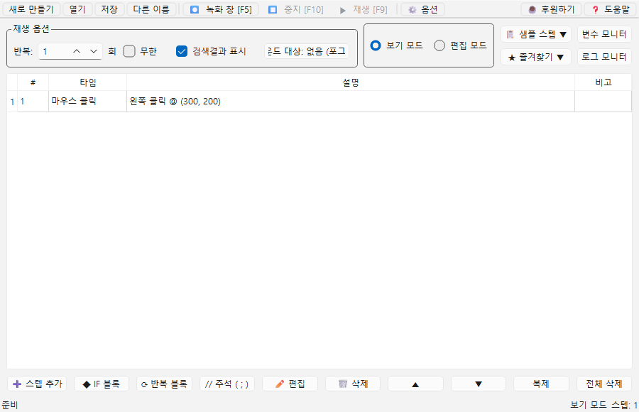
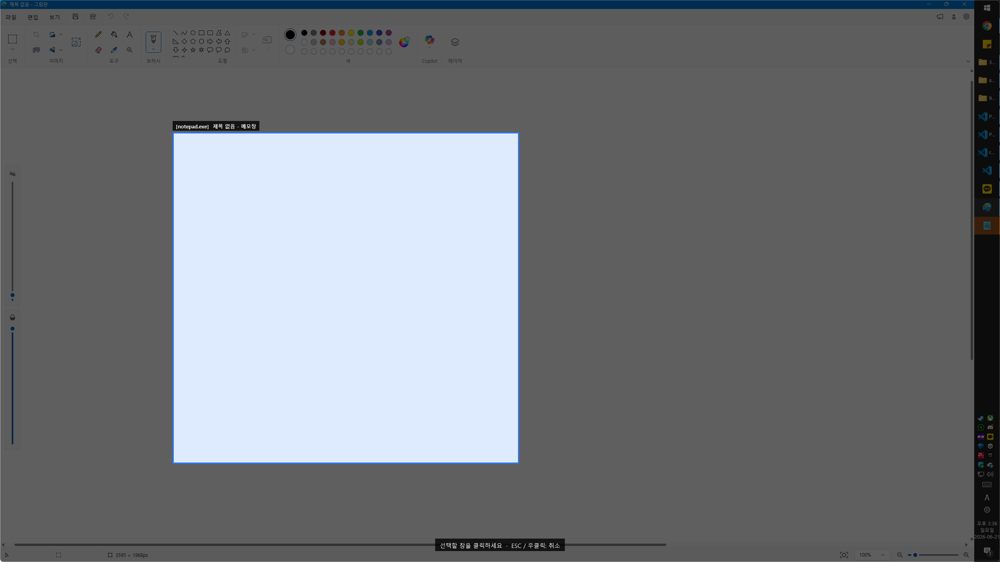
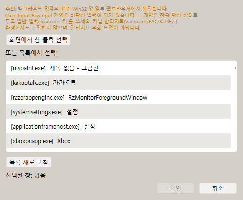
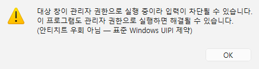
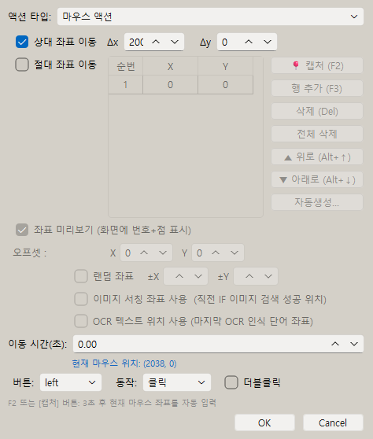
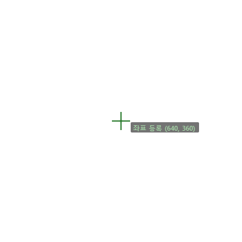

# [사용자 매뉴얼] 14. 백그라운드 입력: 창을 앞으로 가져오지 않고 다른 프로그램에 입력 보내기

## 백그라운드 입력

## 문서 이동

| 구분 | 문서 |
| --- | --- |
| 목록 | [[사용자 매뉴얼] 0. 목록](https://plcman.tistory.com/211) |
| 이전 | [[사용자 매뉴얼] 13. OCR 텍스트 읽기](https://plcman.tistory.com/234) |

## 백그라운드 입력이란?

백그라운드 입력은 대상 창을 맨 앞으로 가져오지 않은 상태에서 그 창에 마우스·키 입력을 직접 보내는 기능입니다.

일반적인 매크로는 입력을 보낼 창이 화면 맨 앞(포그라운드)에 있어야 합니다.
백그라운드 입력을 사용하면 대상 프로그램을 화면 뒤에 두거나 작업표시줄에 최소화하지 않은 채로 두고, 사용자는 다른 창에서 다른 작업을 이어갈 수 있습니다.

대표 사용 예:

- 사내 업무 시스템에 데이터를 입력하는 동안 이메일이나 메신저를 계속 사용한다.
- 자동화 대상 프로그램을 화면 귀퉁이에 작게 두고 다른 작업을 병행한다.
- 여러 프로그램을 순서대로 자동화하되 화면 전환을 줄인다.

> [!NOTE]
> 백그라운드 입력은 표준 Windows 프로그램과 일부 웹 브라우저에서 동작합니다. 자체 입력 처리 방식을 사용하는 일부 프로그램은 지원되지 않을 수 있습니다.

---

## 대상 창 선택하기

메인 화면 상단 재생 영역에 **"백그라운드 대상: 없음 (포그라운드)"** 버튼이 있습니다. 이 버튼을 클릭하면 대상 창 선택 다이얼로그가 열립니다.

<!--kage [##_Image|kage@cLiHzV/dJMcag6ZWuH/AAAAAAAAAAAAAAAAAAAAAPvFxbzmCmgThhNlYQKZe3dIu2FZh_dbF9c4iGZrA_0Q/img.png?credential=yqXZFxpELC7KVnFOS48ylbz2pIh7yKj8&amp;expires=1782831599&amp;allow_ip=&amp;allow_referer=&amp;signature=aFcQOI5QqZKbM1aMoa%2B6MjQ4ANI%3D|CDM|1.3|{"originWidth":900,"originHeight":580,"style":"alignCenter"}_##]-->

### 선택 방법 1: 화면에서 직접 클릭

1. 선택 다이얼로그에서 **"화면에서 창 클릭 선택"** 버튼을 클릭합니다.
2. 화면 전체가 어두워지고 마우스를 올린 창만 밝게 강조됩니다.
3. 입력을 보낼 창 위에 마우스를 올린 뒤 클릭합니다.
4. 선택이 완료되면 버튼 이름이 **"백그라운드 대상: [프로그램명] 창 제목"** 형식으로 바뀝니다.

<!--kage [##_Image|kage@dmeqJX/dJMcag6ZWuR/AAAAAAAAAAAAAAAAAAAAACLUrpozojGqa9QI9VBeEwReLBInP_6hN4iNENkk9SpR/img.png?credential=yqXZFxpELC7KVnFOS48ylbz2pIh7yKj8&amp;expires=1782831599&amp;allow_ip=&amp;allow_referer=&amp;signature=gIa6ne6O9eG4VhIlyE6jzuSl8gY%3D|CDM|1.3|{"originWidth":2560,"originHeight":1440,"style":"alignCenter"}_##]-->

> [!TIP]
> 오버레이가 열린 상태에서 ESC 또는 우클릭을 누르면 선택을 취소할 수 있습니다.

### 선택 방법 2: 목록에서 선택

화면에서 직접 클릭하기 어려운 경우, 다이얼로그 하단의 창 목록에서 프로그램을 찾아 선택하고 **확인** 버튼을 누릅니다. **목록 새로 고침** 버튼으로 현재 열린 창 목록을 다시 불러올 수 있습니다.

<!--kage [##_Image|kage@coeTqh/dJMcafAhTy7/AAAAAAAAAAAAAAAAAAAAAAgxtsLeK2TTOqggh4-mA52aPmXOQHtSQFK0TVGRPDXh/img.png?credential=yqXZFxpELC7KVnFOS48ylbz2pIh7yKj8&amp;expires=1782831599&amp;allow_ip=&amp;allow_referer=&amp;signature=Tc9y7CKtivdohorc4RqIpcW%2B3As%3D|CDM|1.3|{"originWidth":500,"originHeight":412,"style":"alignCenter"}_##]-->

### 대상 창 해제

다시 버튼을 클릭하면 대상이 해제되고 **"백그라운드 대상: 없음 (포그라운드)"** 상태로 돌아갑니다. 이후 재생은 기존 방식(창이 앞에 있어야 입력됨)으로 동작합니다.

---

## 좌표는 대상 창 내부 기준으로 저장됩니다

백그라운드 입력 대상 창이 지정된 상태에서 F2로 좌표를 등록하거나 녹화 내용을 추가하면, 좌표가 **대상 창 내부(클라이언트 영역) 기준**으로 저장됩니다.

이렇게 하면 대상 창을 화면에서 다른 위치로 옮겨도 항상 창 안의 같은 지점을 정확히 클릭합니다.
창 위치가 바뀌거나 다음에 프로그램을 열 때 창이 다른 위치에 생겨도 클릭 위치가 틀어지지 않습니다.

> [!NOTE]
> 대상 창을 지정하지 않은 기존 매크로는 이전과 동일하게 화면 절대 좌표로 동작합니다. 구버전에서 만든 프로젝트도 대상 창을 새로 지정하지 않는 한 동작 방식이 바뀌지 않습니다.

---

## 대상 창을 찾지 못할 때

좌표를 F2로 등록하거나 녹화 내용을 메인에 추가할 때, 지정한 대상 창이 현재 열려 있지 않으면 안내 메시지가 표시되고 작업이 멈춥니다.

이렇게 동작하는 이유는 대상 창이 없는 상태에서 좌표를 등록하면 잘못된 위치가 저장될 수 있기 때문입니다.
녹화한 내용은 그대로 유지되므로 데이터가 사라지지 않습니다.

**해결 방법**: 대상 창(자동화할 프로그램)을 먼저 실행한 뒤 다시 시도합니다.

---

## 관리자 권한 프로그램 대상 안내

대상 창이 관리자 권한으로 실행 중이고, JP's Codeless Macro Tool은 일반 권한으로 실행 중이라면 재생 시 경고 메시지가 표시될 수 있습니다.

이 경우 Windows 보안 정책(UIPI)에 의해 입력이 차단됩니다.
해결하려면 JP's Codeless Macro Tool도 관리자 권한으로 실행하면 됩니다.

<!--kage [##_Image|kage@9QiLT/dJMcaa6QHEP/AAAAAAAAAAAAAAAAAAAAAD7aQ6De5YeuDIe0BMbxs-lt0C5dyU7_qxhe60NW2Mlu/img.png?credential=yqXZFxpELC7KVnFOS48ylbz2pIh7yKj8&amp;expires=1782831599&amp;allow_ip=&amp;allow_referer=&amp;signature=%2B5gYFR6m39NoDFBP652aVHCpe8k%3D|CDM|1.3|{"originWidth":436,"originHeight":117,"style":"alignCenter"}_##]-->

> [!WARNING]
> 관리자 권한으로 실행할 때는 특히 주의하세요. 입력 자동화가 의도치 않은 시스템 설정을 변경하지 않도록 미리 스텝을 충분히 검토하고 테스트합니다.

---

## 함께 추가된 입력 호환성 기능

v1.3.x 업데이트에서 백그라운드 입력과 함께 아래 기능들이 추가·개선됐습니다.

### 키 입력 스캔코드 호환

일부 프로그램은 일반적인 키 입력을 인식하지 못하는 경우가 있습니다. v1.3.0부터 표준 Windows 입력 방식(스캔코드)을 우선 사용해 이런 프로그램에서도 키 입력이 정상 동작하도록 개선됐습니다.

별도 설정 없이 자동으로 적용됩니다. 기존 매크로의 키 입력 동작은 이전과 동일합니다.

### 마우스 상대 좌표 이동

마우스 스텝(클릭·누름·뗌)에 **"상대 좌표 이동"** 옵션이 추가됐습니다. 화면의 고정된 좌표가 아니라 **현재 커서 위치에서 Δx/Δy만큼 상대 이동**한 뒤 버튼 동작(클릭·누름·뗌)을 한 스텝으로 처리합니다.

**상대 좌표 이동** 옵션을 켜면 Δx·Δy 입력란과 **이동 시간(초)** 항목이 활성화됩니다. 이동 시간을 설정하면 커서가 지정한 시간에 걸쳐 이동하므로 이동 속도를 조절할 수 있습니다.

#### 항목별 설명

| 항목 | 설명 |
| --- | --- |
| **상대 좌표 이동** 체크박스 | 켜면 Δx/Δy 상대 이동 모드가 활성화됩니다. 절대 좌표 이동(기존 방식)과 동시에 켤 수 없으며 둘 중 하나만 선택합니다. |
| **Δx** | 수평 이동량(픽셀). 양수=오른쪽, 음수=왼쪽. |
| **Δy** | 수직 이동량(픽셀). 양수=아래쪽, 음수=위쪽. |
| **이동 시간(초)** | 커서 이동에 걸리는 시간. 0이면 즉시 이동합니다. 절대 이동과 상대 이동 모두에 적용됩니다. |

<!--kage [##_Image|kage@coOKUU/dJMcai4Lim6/AAAAAAAAAAAAAAAAAAAAAMwoPNRZ0CMXs_VWUYMWNEFbaeQ5kleRoKyMAx4zbEVJ/img.png?credential=yqXZFxpELC7KVnFOS48ylbz2pIh7yKj8&amp;expires=1782831599&amp;allow_ip=&amp;allow_referer=&amp;signature=zdaoT%2BlYP1kAohvC9UdqXILOHME%3D|CDM|1.3|{"originWidth":474,"originHeight":558,"style":"alignCenter"}_##]-->

> [!NOTE]
> 상대 좌표 이동은 포그라운드(창이 앞에 있는) 입력에서만 동작합니다. 백그라운드 대상 창이 지정된 상태에서 상대 이동 스텝을 실행하면 경고 후 해당 스텝을 건너뜁니다.

#### 실전 예시: 현재 위치에서 오른쪽으로 이동한 뒤 클릭

**상황**: 커서가 있는 위치에서 오른쪽으로 200픽셀 이동한 뒤 클릭한다.

1. 마우스 클릭 스텝을 추가합니다.
2. **"상대 좌표 이동"** 체크박스를 켭니다.
3. Δx에 `200`, Δy에 `0`을 입력합니다.
4. 필요하면 이동 시간을 설정합니다.
5. 스텝을 저장합니다.

재생 시 현재 커서 위치에서 오른쪽으로 200픽셀 이동한 뒤 클릭합니다.
화면에 표시되는 절대 좌표가 달라져도 이동량은 항상 동일합니다.

### 전체화면 프로그램 화면 인식 (DXGI 캡처)

일부 전체화면 프로그램에서 화면이 검게 캡처되어 이미지 검색과 OCR이 제대로 동작하지 않는 문제가 있었습니다. v1.3.0부터 표준 Windows 화면 복제 방식(DXGI)을 우선 사용해 이 문제를 해결했습니다.

별도 설정 없이 자동으로 적용됩니다. DXGI가 지원되지 않는 환경에서는 기존 캡처 방식으로 자동 전환됩니다. 일반 창 모드 프로그램의 캡처 동작은 이전과 동일합니다.

---

## F2 빠른 좌표 등록 화면 표시

메인 화면에서 F2를 눌러 좌표를 등록할 때, 커서 위치에 녹색 십자선과 좌표 정보가 잠깐 표시됩니다.
등록된 지점을 눈으로 즉시 확인할 수 있어 좌표가 정확히 잡혔는지 빠르게 파악할 수 있습니다.

<!--kage [##_Image|kage@ck4a7m/dJMcajbvQ8k/AAAAAAAAAAAAAAAAAAAAAFtaJYVZBuDiStqKoofhkl-MWBwvMtT4FGo6llRfd940/img.png?credential=yqXZFxpELC7KVnFOS48ylbz2pIh7yKj8&amp;expires=1782831599&amp;allow_ip=&amp;allow_referer=&amp;signature=icsQh6lKNmRQrs0vO1FNC56akeY%3D|CDM|1.3|{"originWidth":400,"originHeight":400,"style":"alignCenter"}_##]-->

---

## 실전 예시: 백그라운드로 업무 프로그램 자동 입력하기

**상황**: 사내 데이터 입력 프로그램이 화면 뒤에 있는 상태에서 특정 항목을 클릭하고 값을 입력하는 반복 작업을 자동화한다.

1. 데이터 입력 프로그램을 실행합니다.
2. JP's Codeless Macro Tool 메인에서 **"백그라운드 대상: 없음 (포그라운드)"** 버튼을 클릭합니다.
3. 선택 다이얼로그에서 **"화면에서 창 클릭 선택"** 을 누르고, 데이터 입력 프로그램 창 위에서 클릭합니다.
4. 버튼이 **"백그라운드 대상: [데이터입력.exe] …"** 로 바뀌면 선택 완료입니다.
5. F2로 입력 항목의 좌표를 등록하거나 녹화로 스텝을 구성합니다. 좌표는 대상 창 내부 기준으로 저장됩니다.
6. 재생 버튼을 누릅니다. 데이터 입력 프로그램이 화면 앞으로 튀어나오지 않고 백그라운드에서 입력이 자동으로 진행됩니다.

---

## 주의사항

### 동작하는 프로그램과 동작하지 않는 프로그램

백그라운드 입력은 표준 Windows 입력 경로를 사용합니다.

- **동작하는 경우**: 일반적인 Windows 데스크톱 프로그램, 일부 웹 브라우저
- **동작하지 않는 경우**: 자체 입력 처리 방식(DirectInput/RawInput 등)을 사용하는 일부 프로그램. 이런 경우에는 대상 창을 맨 앞에 활성화한 상태로 두고 일반 입력(포그라운드 모드)으로 사용하세요.

### 이용약관 확인

자동화 대상 프로그램의 이용약관에서 자동화 입력을 허용하는지 반드시 확인하세요. 특히 인터넷 기반 서비스는 매크로·자동화 사용을 금지하는 경우가 있습니다.

> [!WARNING]
> JP's Codeless Macro Tool은 합법적인 반복 작업을 돕기 위한 도구입니다. 사용 중인 프로그램의 이용약관을 확인하고, 허용된 범위 내에서만 사용하세요.

### 실행 전 충분히 테스트하세요

백그라운드로 실행되는 매크로는 화면 변화를 직접 보기 어렵습니다. 처음에는 포그라운드(창을 앞에 둔) 상태에서 스텝을 확인하고, 동작이 확인된 뒤에 백그라운드 모드를 사용하세요.

### 마우스·키보드를 건드리면 매크로가 방해받을 수 있습니다

백그라운드 입력 중에는 사용자가 같은 대상 창에 직접 마우스나 키보드를 사용하면 매크로와 입력이 섞여 예상치 못한 결과가 생길 수 있습니다.
재생 중에는 대상 창을 직접 조작하지 않는 것이 좋습니다.

---

## 관련 문서

- 녹화로 스텝을 만드는 방법은 [[사용자 매뉴얼] 3. 녹화와 재생](https://plcman.tistory.com/216) 문서를 참고하세요.
- 이미지 검색과 화면 캡처 활용은 [[사용자 매뉴얼] 8. 이미지 검색과 캡처](https://plcman.tistory.com/221) 문서를 참고하세요.
- OCR로 화면의 글자를 읽는 방법은 [[사용자 매뉴얼] 13. OCR 텍스트 읽기](https://plcman.tistory.com/234) 문서를 참고하세요.
- 전체 옵션과 단축키는 [[사용자 매뉴얼] 9. 옵션과 단축키](https://plcman.tistory.com/222) 문서를 참고하세요.
- 프로그램 다운로드와 전체 기능 소개는 [JP's Codeless Macro Tool 다운로드·배포 안내](https://plcman.tistory.com/209)에서 볼 수 있습니다.
- 전체 매뉴얼 목차는 [[사용자 매뉴얼] 0. 목록](https://plcman.tistory.com/211)에서 볼 수 있습니다.

## 다음에 읽을 문서

- 이전: [[사용자 매뉴얼] 13. OCR 텍스트 읽기](https://plcman.tistory.com/234)
