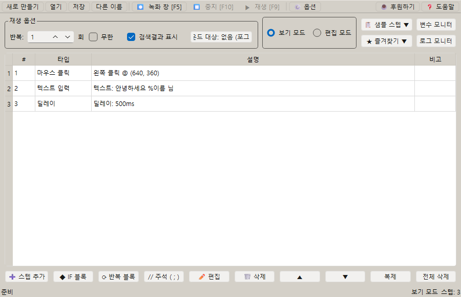
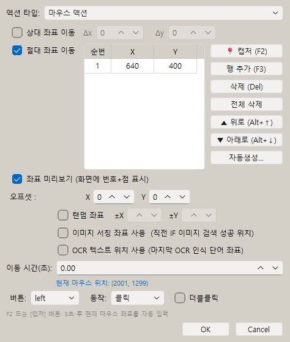
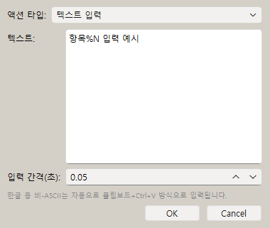

# [사용자 매뉴얼] 2. 기본 편집과 파일관리: 매크로 스텝 편집과 저장하기

## 기본 편집과 파일 관리

## 문서 이동

| 구분 | 문서 |
| --- | --- |
| 목록 | [[사용자 매뉴얼] 0. 목록](https://plcman.tistory.com/211) |
| 이전 | [[사용자 매뉴얼] 1. 기능설명](https://plcman.tistory.com/214) |
| 다음 | [[사용자 매뉴얼] 3. 녹화와 재생](https://plcman.tistory.com/216) |

## 프로젝트 만들기

처음 실행하면 매크로 스크립트를 저장할 프로젝트를 만들 수 있습니다.

프로젝트는 여러 스텝과 관련 파일을 함께 보관하는 작업 단위입니다.

## 스텝 추가

스텝은 매크로가 실행할 동작 하나를 의미합니다.

예를 들어 다음 동작들이 각각 하나의 스텝이 됩니다.

- 마우스 클릭
- 키보드 입력
- 텍스트 입력
- 이미지 찾기
- 조건 시작
- 반복 시작
- 딜레이

스텝을 추가한 뒤 필요한 값을 입력하면 매크로 순서가 만들어집니다.

## 보기 모드와 편집 모드

v1.0.24 이후에는 보기 모드와 편집 모드를 구분합니다.

- 보기 모드: 스텝을 확인하고 실행하기 위한 모드입니다.
- 편집 모드: 스텝 추가, 수정, 삭제, 이동 같은 변경 작업을 하는 모드입니다.

새 프로젝트를 만들거나 파일을 열면 보기 모드로 시작합니다.
스텝을 바꾸려면 편집 모드로 전환한 뒤 작업합니다.
이 구분은 실행 전 스텝을 실수로 수정하는 일을 줄이는 데 도움이 됩니다.

<!--kage [##_Image|kage@6ttle/dJMcaiw0z2k/AAAAAAAAAAAAAAAAAAAAAJjGl6En0s8apFxBVW2Gm3n07xkNtC9rJwUVgc0HpNYE/img.png?credential=yqXZFxpELC7KVnFOS48ylbz2pIh7yKj8&amp;expires=1782831599&amp;allow_ip=&amp;allow_referer=&amp;signature=tZw4UWxC2s8398KPtvR%2BpBTn7YU%3D|CDM|1.3|{"originWidth":900,"originHeight":580,"style":"alignCenter"}_##]-->

## 스텝 편집

이미 만든 스텝은 선택해서 다시 수정할 수 있습니다.

v1.0.22부터는 메인 화면 스텝 테이블에서 행을 선택한 뒤 `Enter` 키를 눌러 바로 편집할 수 있습니다.

자주 수정하는 항목은 다음과 같습니다.

- 클릭 좌표
- 키보드 키
- 입력할 텍스트
- 대기 시간
- 반복 횟수
- 조건 값
- 주석

## 마우스 액션 스텝

마우스 액션 스텝은 다섯 가지입니다.

| 스텝 | 동작 | 사용 시점 |
| --- | --- | --- |
| 마우스 이동 | 지정한 좌표로 커서를 이동합니다 | 클릭 없이 위치만 옮길 때 |
| 마우스 클릭 | 클릭합니다 (누름과 뗌을 한 번에 수행) | 버튼 클릭, 선택 |
| 마우스 누름 | 버튼을 누른 채로 유지합니다 | 드래그 시작 |
| 마우스 뗌 | 누르고 있던 버튼을 뗍니다 | 드래그 끝 |
| 마우스 스크롤 | 지정한 방향으로 스크롤합니다 | 목록 스크롤, 페이지 이동 |

대부분의 클릭 동작은 `마우스 클릭` 하나로 처리합니다.
더블클릭은 마우스 클릭 스텝의 옵션에서 선택합니다.

`마우스 누름`과 `마우스 뗌`은 드래그처럼 버튼을 누른 상태를 유지해야 할 때 한 쌍으로 사용합니다.

예시: 파일을 끌어서 다른 위치로 옮기는 경우

1. 마우스 이동 스텝으로 파일 위치로 이동합니다.
2. 마우스 누름 스텝에서 왼쪽 버튼을 누릅니다.
3. 마우스 이동 스텝으로 목적지 위치로 이동합니다.
4. 마우스 뗌 스텝에서 왼쪽 버튼을 뗍니다.

<!--kage [##_Image|kage@de0MqT/dJMcad3s4Lv/AAAAAAAAAAAAAAAAAAAAACiDkNZhacPFUp365Tq5zFbql2WrexT9e5TpRgxENy-l/img.png?credential=yqXZFxpELC7KVnFOS48ylbz2pIh7yKj8&amp;expires=1782831599&amp;allow_ip=&amp;allow_referer=&amp;signature=CSr711zS0cn0U0f9lRXM3jAzujE%3D|CDM|1.3|{"originWidth":474,"originHeight":558,"style":"alignCenter"}_##]-->

## 키보드 액션 스텝

키보드 액션 스텝은 세 가지입니다.

| 스텝 | 동작 | 사용 시점 |
| --- | --- | --- |
| 키 입력 | 키를 누르고 즉시 뗍니다 | 일반적인 단일 키 입력 |
| 키 누름 | 키를 누른 채로 유지합니다 | 드래그 보조, 조합키 유지 |
| 키 뗌 | 누르고 있던 키를 뗍니다 | 유지하던 키 해제 |

대부분의 키보드 작업은 `키 입력` 하나로 충분합니다.
`ctrl+c`, `shift+tab` 같은 조합키도 `키 입력` 스텝 하나에서 처리할 수 있습니다.

`키 누름`과 `키 뗌`은 키를 누른 상태에서 다른 동작을 함께 실행해야 할 때 한 쌍으로 사용합니다.

예시: Shift를 누른 채로 항목을 클릭해 범위 선택

1. 마우스 클릭 스텝으로 첫 항목을 클릭합니다.
2. 키 누름 스텝에서 `shift`를 선택합니다.
3. 마우스 클릭 스텝으로 마지막 항목을 클릭합니다.
4. 키 뗌 스텝에서 `shift`를 해제합니다.

## 텍스트 입력 스텝

텍스트 입력 스텝은 지정한 문자열을 자동으로 입력합니다.

한글, 영문, 숫자, 특수문자가 섞인 짧은 단어부터 긴 문장까지 사용할 수 있습니다.

`%변수명` 형식을 텍스트 안에 넣으면 실행 시점의 변수 값으로 자동 치환됩니다.
입력 칸에서 `%`를 누르면 선언된 변수가 있을 때 변수 선택 팝업이 표시됩니다.

예: 변수 `N`의 값이 `001`이면 `항목%N` → `항목001`로 입력됩니다.

변수를 사용한 자세한 활용법은 [[사용자 매뉴얼] 7. 변수와 연산](https://plcman.tistory.com/220)을 참조합니다.

<!--kage [##_Image|kage@5EiBx/dJMcad3s4LB/AAAAAAAAAAAAAAAAAAAAAOurw98XY9c24dRa2lGzIiHyDjlQzBSSrJ5oBe-xEInJ/img.png?credential=yqXZFxpELC7KVnFOS48ylbz2pIh7yKj8&amp;expires=1782831599&amp;allow_ip=&amp;allow_referer=&amp;signature=LIXvDj%2BUhrqNhCslt7%2F9Yam%2Bj70%3D|CDM|1.3|{"originWidth":380,"originHeight":321,"style":"alignCenter"}_##]-->

## 딜레이 스텝

딜레이 스텝은 다음 동작으로 넘어가기 전에 기다리는 스텝입니다.

대기 유형은 두 가지입니다.

- 시간 대기: 지정한 시간(ms)만큼 기다린 뒤 다음 스텝으로 진행합니다.
- 클립보드 변경 대기: 현재 클립보드 내용이 바뀔 때까지 기다립니다. 최대 대기 시간이 지나면 변경이 없어도 다음 스텝으로 진행합니다.

클립보드 변경 대기는 `Ctrl+C` 같은 복사 동작 직후, 복사가 완료되는 시점까지 기다릴 때 사용할 수 있습니다.

예시: 웹페이지의 주문번호를 복사한 뒤 다음 입력칸에 붙여넣는 경우

1. 키보드 액션으로 `ctrl+c`를 실행합니다.
2. 딜레이 스텝을 추가하고 `클립보드 변경 대기`를 선택합니다.
3. 최대 대기 시간을 1초에서 3초 정도로 설정합니다.
4. 다음 스텝에서 `ctrl+v` 또는 텍스트 입력을 실행합니다.

이렇게 구성하면 복사가 끝나기 전에 붙여넣기가 먼저 실행되는 상황을 줄일 수 있습니다.

## 마우스 좌표 입력

마우스 이동, 클릭, 누름, 뗌 스텝에서는 클릭할 위치를 인라인 좌표 테이블로 입력합니다.

v1.0.43부터 단일 좌표와 좌표 어레이(여러 좌표)를 **하나의 테이블**로 통합해 사용합니다.
기본 1행에서 시작하므로 좌표가 하나뿐이면 기존과 똑같이 사용할 수 있고, 행을 추가하면 그대로 좌표 어레이가 됩니다.

### 테이블 조작 버튼

테이블 옆에 있는 버튼으로 좌표를 추가하거나 바꿀 수 있습니다.

| 버튼 | 동작 |
| --- | --- |
| 캡처 (F2) | 지금 마우스 커서 위치를 즉시 입력합니다 |
| 캡처 (3초) | 3초 카운트다운 뒤 마우스 커서 위치를 입력합니다 |
| 행 추가 | 새 행을 추가해 좌표를 하나 더 등록합니다 |
| 삭제 | 선택한 행을 지웁니다 |
| 전체 삭제 | 모든 행을 지우고 빈 1행으로 되돌립니다 |
| 위로 / 아래로 | 선택한 행의 순서를 바꿉니다 |
| 자동생성 | 격자 형태의 좌표 목록을 자동으로 만들어 추가합니다 |

편집 중에는 등록한 좌표의 위치가 화면에 번호와 점으로 실시간 표시됩니다.
"좌표 미리보기" 체크박스로 이 표시를 끌 수 있습니다.

### 좌표 어레이 동작 방식

행이 2개 이상이면 좌표 어레이가 됩니다.
반복문 안에서 마우스 스텝을 실행하면 반복 횟수에 따라 좌표가 순서대로 적용됩니다.

| 반복 회차 | 사용 좌표 |
| --- | --- |
| 1회차 | 첫 번째 좌표 |
| 2회차 | 두 번째 좌표 |
| 3회차 | 세 번째 좌표 |
| 4회차 (어레이가 3개면) | 다시 첫 번째 좌표 |

예시: 표의 세 줄에 있는 같은 버튼을 순서대로 누르는 경우

1. 반복 시작 스텝을 추가하고 반복 횟수를 `3`으로 설정합니다.
2. 마우스 클릭 스텝을 추가합니다.
3. 좌표 테이블에서 행 추가를 눌러 3개의 좌표를 순서대로 입력합니다.
4. 반복 끝 스텝을 추가합니다.

실행하면 1회차에는 첫 번째 좌표, 2회차에는 두 번째 좌표, 3회차에는 세 번째 좌표를 클릭합니다.

좌표 어레이 자동 생성(격자 좌표 한 번에 만들기)과 반복 활용 예시는 [[사용자 매뉴얼] 5. 반복](https://plcman.tistory.com/218)에서 자세히 설명합니다.

## 주석 스텝

주석 스텝은 매크로 흐름에 메모를 남기는 스텝입니다. 실행 시 아무 동작도 하지 않습니다.

긴 매크로를 여러 구간으로 나눠 역할을 설명하거나, 임시로 비활성화한 스텝의 이유를 기록하는 데 사용합니다.

스텝 목록에서 `;` 단축키를 누르면 빠르게 주석 스텝을 추가할 수 있습니다.

예시 흐름:

| 스텝 | 내용 |
| --- | --- |
| 주석 | 로그인 처리 |
| 텍스트 입력 | 아이디 입력 |
| 텍스트 입력 | 비밀번호 입력 |
| 주석 | 메인 화면 진입 대기 |
| 딜레이 | 1000ms |

주석은 실행 흐름에는 영향을 주지 않으므로 자유롭게 추가해도 매크로 동작에는 변화가 없습니다.

## 스텝 순서 변경

스텝은 위에서 아래 순서대로 실행됩니다.

순서가 중요하므로 필요한 경우 스텝을 위/아래로 이동해 실행 흐름을 조정합니다.

여러 스텝을 선택해 한 번에 이동하거나 삭제할 수 있습니다.

## 저장

작업한 매크로는 저장해야 다음에 다시 열 수 있습니다.

기본 저장 단축키는 `Ctrl+S`입니다.

저장하지 않은 상태에서 종료하거나 다른 프로젝트를 열면 변경 내용이 사라질 수 있습니다.

## 파일 구성

v1.0.21 이후 실행 파일명은 다음과 같습니다.

- `JPsCodelessMacroTool.exe`

실행 후 같은 위치에 설정과 프로젝트 파일이 생성됩니다.

- `script/`
- `app_config.json`
- `favorites.json`

다른 PC로 옮길 때는 exe와 위 파일/폴더를 함께 복사하면 됩니다.

## 이름 변경 안내

기존 버전에서 사용하던 MacroFlow 이름은 v1.0.21부터 JP's Codeless Macro Tool로 변경되었습니다.

기존 사용 흐름은 유지되며, 새 배포 파일은 `JPsCodelessMacroTool.exe`입니다.

## 관련 문서

- 같은 작업을 정해진 횟수만큼 반복하려면 [[사용자 매뉴얼] 5. 반복](https://plcman.tistory.com/218) 문서를 참고하세요.
- 반복마다 값이나 문장을 바꿔 입력하려면 [[사용자 매뉴얼] 7. 변수와 연산](https://plcman.tistory.com/220) 문서를 참고하세요.
- 프로그램 다운로드와 전체 기능 소개는 [JP's Codeless Macro Tool 다운로드·배포 안내](https://plcman.tistory.com/209)에서 볼 수 있습니다.
- 전체 매뉴얼 목차는 [[사용자 매뉴얼] 0. 목록](https://plcman.tistory.com/211)에서 볼 수 있습니다.

## 다음에 읽을 문서

- 이전: [[사용자 매뉴얼] 1. 기능설명](https://plcman.tistory.com/214)
- 다음: [[사용자 매뉴얼] 3. 녹화와 재생](https://plcman.tistory.com/216)
