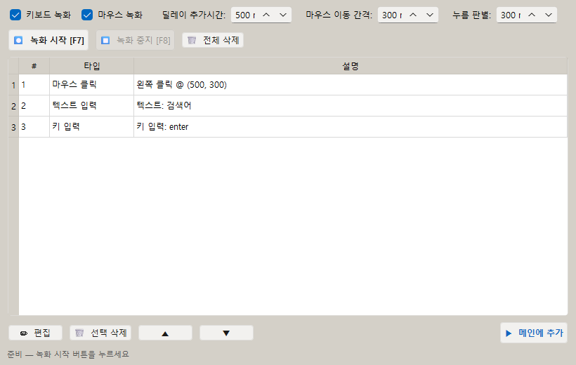
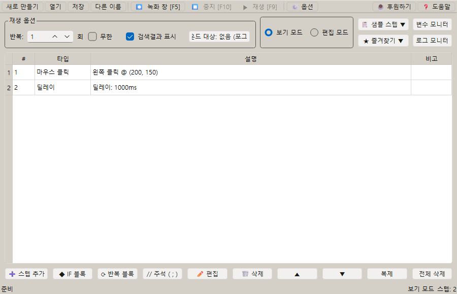

# [사용자 매뉴얼] 3. 녹화와 재생: 마우스·키보드 동작 녹화하고 재생하기

## 녹화와 재생

## 문서 이동

| 구분 | 문서 |
| --- | --- |
| 목록 | [[사용자 매뉴얼] 0. 목록](https://plcman.tistory.com/211) |
| 이전 | [[사용자 매뉴얼] 2. 기본 편집과 파일관리](https://plcman.tistory.com/215) |
| 다음 | [[사용자 매뉴얼] 4. 조건](https://plcman.tistory.com/217) |

## 녹화 기능

녹화 기능은 실제 마우스와 키보드 동작을 기록해 스텝으로 변환합니다.

처음 매크로를 만들 때 전체 흐름을 빠르게 잡는 데 유용합니다.

녹화 후에는 불필요한 딜레이를 줄이거나, 특정 부분에 조건과 반복을 추가해 안정성을 높일 수 있습니다.

녹화로 만든 마우스 좌표가 반복마다 달라져야 한다면, 녹화 후 마우스 스텝을 편집해 좌표 어레이로 바꾸는 방식이 좋습니다.

<!--kage [##_Image|kage@CRmrQ/dJMcabkodkI/AAAAAAAAAAAAAAAAAAAAACnozOdWceXYQlK4-FPQYW5Kb-SJy3jaYULVI4MrI6In/img.png?credential=yqXZFxpELC7KVnFOS48ylbz2pIh7yKj8&amp;expires=1782831599&amp;allow_ip=&amp;allow_referer=&amp;signature=pPcGt9TtnP81wF9LUE71wi0hYAk%3D|CDM|1.3|{"originWidth":820,"originHeight":520,"style":"alignCenter"}_##]-->

## 녹화 예시

처음 만드는 매크로는 녹화로 큰 흐름을 잡고, 이후 편집으로 안정성을 높이는 방식이 좋습니다.

예시: 검색창에 문장을 입력하고 결과 버튼을 누르는 작업

1. 녹화를 시작합니다.
2. 검색창을 클릭합니다.
3. 검색어를 입력합니다.
4. 검색 버튼을 클릭합니다.
5. 녹화를 종료합니다.
6. 생성된 스텝에서 불필요한 마우스 이동을 삭제합니다.
7. 검색 결과가 늦게 표시된다면 고정 딜레이 대신 이미지 조건이나 딜레이 스텝을 추가합니다.

## 마우스 드래그 녹화

마우스 버튼을 누른 채 끌어서 이동하는 동작(드래그)도 녹화할 수 있습니다.

드래그를 녹화하면 이동 경로(궤적)와 각 지점까지 실제로 움직인 시간(이동시간)이 함께 기록됩니다.
재생 시에도 같은 속도와 경로로 드래그를 재현하기 때문에 그림판처럼 마우스를 누른 채 끌어 그리는 작업에도 사용할 수 있습니다.

**멈춤 시간과 이동 시간 구분**

녹화 중 마우스가 가만히 있던 시간은 딜레이 스텝으로 기록되고, 실제로 움직인 시간은 마우스 스텝의 이동시간으로 기록됩니다.
스텝 목록에서 마우스 이동·클릭·누름·뗌 스텝의 설명에 이동시간이 함께 표시됩니다.

**녹화 옵션 — 마우스 이동 간격**

드래그 궤적을 얼마나 촘촘하게 기록할지는 녹화 옵션의 "마우스 이동 간격"으로 조절합니다.
기본값은 300ms입니다.
값을 줄이면 더 촘촘하게 기록되고, 값을 키우면 스텝 수가 줄어듭니다.

> [!TIP]
> 드래그 경로가 중요한 작업(손으로 그리기, 슬라이더 조작 등)은 이동 간격을 줄여 녹화하면 더 정확하게 재현됩니다.

> [!NOTE]
> 이전 버전에서 만든 마우스 스텝에는 이동시간 정보가 없을 수 있습니다. 이 경우 스텝 설명에 이동시간이 표시되지 않으며, 재생 시 이동시간 없이 동작합니다.

## 녹화 후 정리할 것

녹화로 만든 스텝은 그대로 써도 되지만, 보통 다음 항목을 정리하면 더 안정적입니다.

- 너무 긴 딜레이 줄이기
- 복사 직후에는 고정 딜레이 대신 클립보드 변경 대기 사용 검토
- 불필요한 마우스 이동 삭제
- 클릭 위치 확인
- 반복마다 다른 위치를 눌러야 하면 좌표 어레이로 정리
- 반복되는 구간을 루프로 묶기
- 화면 상태가 필요한 곳에 이미지 조건 추가

## 재생

저장한 매크로는 실행 버튼이나 전역 단축키로 재생할 수 있습니다.

기본 단축키는 다음과 같습니다.

- 재생: `F9`
- 중지: `F6`

단축키는 옵션에서 변경할 수 있습니다.

<!--kage [##_Image|kage@cRi78f/dJMcaf1iOPf/AAAAAAAAAAAAAAAAAAAAAGZielnAJku2LmGzJRJUTA2o-Hc2Hauhx_gh0VqBVU6P/img.png?credential=yqXZFxpELC7KVnFOS48ylbz2pIh7yKj8&amp;expires=1782831599&amp;allow_ip=&amp;allow_referer=&amp;signature=Bcy2r%2Fq5DOnM6Em51x2j3L%2Bqitw%3D|CDM|1.3|{"originWidth":900,"originHeight":580,"style":"alignCenter"}_##]-->

## 반복 재생

반복 횟수를 지정하면 같은 매크로를 여러 번 실행할 수 있습니다.

반복 실행 중 변수 초기화 옵션이 켜진 변수는 매 반복마다 초기값으로 돌아갑니다.

변수별로 반복 초기화 여부를 개별적으로 선택할 수 있습니다.

예시: 같은 검색 작업을 5회 반복하면서 검색어 번호를 바꾸는 경우

1. 변수 `N`을 만들고 초기값을 `001`로 설정합니다.
2. 텍스트 입력 스텝에 `상품%N`을 입력합니다.
3. 검색 버튼 클릭 스텝을 추가합니다.
4. 변수 계산 스텝으로 `N`을 1 증가시킵니다.
5. 전체 구간을 반복 시작과 반복 끝으로 감싸고 반복 횟수를 `5`로 설정합니다.

## 실행 중 중지

매크로가 실행 중일 때는 중지 단축키를 눌러 멈출 수 있습니다.

자동화는 실제 입력을 발생시키므로, 예상과 다르게 동작하면 즉시 중지하는 것이 좋습니다.

## 전역 단축키

전역 단축키는 프로그램 창이 뒤에 있어도 동작합니다.

다른 프로그램의 단축키와 충돌하면 옵션에서 재생/중지 단축키를 변경하세요.

## 관련 문서

- 녹화한 동작을 여러 번 반복 실행하려면 [[사용자 매뉴얼] 5. 반복](https://plcman.tistory.com/218) 문서를 참고하세요.
- 위치가 바뀌는 버튼을 이미지로 찾아 클릭하려면 [[사용자 매뉴얼] 8. 이미지 검색과 캡처](https://plcman.tistory.com/221) 문서를 참고하세요.
- 프로그램 다운로드와 전체 기능 소개는 [JP's Codeless Macro Tool 다운로드·배포 안내](https://plcman.tistory.com/209)에서 볼 수 있습니다.
- 전체 매뉴얼 목차는 [[사용자 매뉴얼] 0. 목록](https://plcman.tistory.com/211)에서 볼 수 있습니다.

## 다음에 읽을 문서

- 이전: [[사용자 매뉴얼] 2. 기본 편집과 파일관리](https://plcman.tistory.com/215)
- 다음: [[사용자 매뉴얼] 4. 조건](https://plcman.tistory.com/217)
