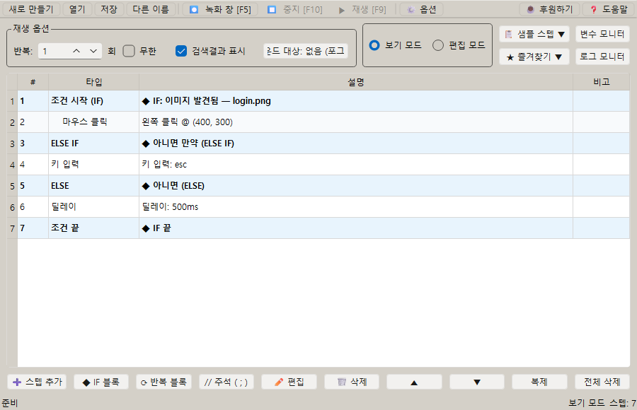

# [사용자 매뉴얼] 4. 조건: 조건에 따라 분기하는 매크로 만들기

## 조건

## 문서 이동

| 구분 | 문서 |
| --- | --- |
| 목록 | [[사용자 매뉴얼] 0. 목록](https://plcman.tistory.com/211) |
| 이전 | [[사용자 매뉴얼] 3. 녹화와 재생](https://plcman.tistory.com/216) |
| 다음 | [[사용자 매뉴얼] 5. 반복](https://plcman.tistory.com/218) |
| 관련 | [[사용자 매뉴얼] 6. 포인터](https://plcman.tistory.com/219) |

## 조건 스텝이란?

조건 스텝은 특정 상황에서만 내부 스텝을 실행하게 만드는 기능입니다.

화면 상태가 매번 같지 않은 업무에서는 단순히 순서대로 클릭하는 매크로보다 조건을 넣은 매크로가 더 안정적입니다.

## 지원 조건

대표 조건은 다음과 같습니다.

| 조건 | 사용 예 |
| --- | --- |
| 픽셀 색상이 일치 | 상태 표시등 색상이 초록색일 때만 실행 |
| 이미지 발견됨 | 저장 완료 메시지가 보일 때 다음 작업 실행 |
| 이미지 없음 | 로딩 아이콘이 사라졌을 때 다음 작업 실행 |
| 키가 눌려 있음 | 특정 키를 누른 동안만 분기 실행 |
| 변수 값 비교 | 복사한 값이나 계산 결과에 따라 다른 작업 실행 |
| 항상 참 | 조건 없이 항상 해당 분기를 실행 (기본 동작 강제) |
| 항상 거짓 | 해당 분기를 항상 건너뜀 (임시 비활성화 용도) |

## 예시 1: 오류 팝업이 보일 때만 닫기

1. 오류 팝업의 제목이나 닫기 버튼 이미지를 캡처합니다.
2. 조건 시작 스텝을 추가합니다.
3. 조건을 `이미지 발견됨`으로 설정합니다.
4. 조건 안에 닫기 버튼 클릭 스텝을 넣습니다.
5. 조건 끝 스텝을 추가합니다.

팝업이 없으면 내부 클릭 스텝은 실행되지 않습니다.

## 예시 2: 로딩 아이콘이 사라진 뒤 다음 작업 실행

1. 로딩 아이콘 이미지를 캡처합니다.
2. 조건 시작 스텝을 추가합니다.
3. 조건을 `이미지 없음`으로 설정합니다.
4. 조건 안에 다음 버튼 클릭이나 텍스트 입력 스텝을 넣습니다.
5. 필요한 경우 앞에 짧은 딜레이를 추가해 화면 갱신 시간을 확보합니다.

이 방식은 고정 시간 대기보다 화면 상태에 맞춰 움직일 수 있습니다.

## 예시 3: 변수 값이 특정 값일 때만 실행

1. 변수 설정 또는 정규식 추출로 비교할 값을 저장합니다.
2. 조건 시작 스텝을 추가합니다.
3. 조건을 `변수 값 비교`로 설정합니다.
4. 변수, 비교 조건, 비교대상을 입력합니다.
5. 조건 안에 필요한 스텝을 넣습니다.

비교대상에는 숫자, 일반 문자열, `%변수명`을 입력할 수 있습니다.
`%`를 입력하면 선언된 변수가 있을 때 변수 선택 팝업이 표시됩니다.

예를 들어 `결과` 변수가 `성공`일 때만 저장 버튼을 누르게 만들 수 있습니다.

## 예시 4: 특정 키를 누르고 있을 때만 실행

1. 조건 시작 스텝을 추가합니다.
2. 조건을 `키가 눌려 있음`으로 설정합니다.
3. 감지할 키를 선택합니다.
4. 조건 안에 실행할 스텝을 넣습니다.

테스트 중 특정 동작만 임시로 실행하고 싶을 때 사용할 수 있습니다.

## 조건 분기 종류 한눈에 보기

`조건 시작`만으로는 참/거짓 두 가지만 다룰 수 있습니다.
화면에 표시되는 분기 스텝은 다음과 같이 한글 이름으로 표시됩니다.

| 분기 스텝 | 표시명 | 역할 |
| --- | --- | --- |
| AND | 그리고 | 앞 조건과 함께 모두 참이어야 같은 분기를 실행 |
| OR | 또는 | 조건을 하나 더 추가해 둘 중 하나라도 참이면 공통 스텝을 실행 |
| ELSE IF | 아니면 만약 | 앞 조건이 거짓일 때 완전히 다른 새 조건으로 분기 |
| ELSE | 아니면 | 위의 모든 조건이 거짓일 때 실행 |
| IF_END | 조건 끝 | 전체 조건 체인을 닫음 (분기마다 따로 닫지 않음) |
| IF_BREAK | 조건 탈출 (BREAK) | 중첩된 조건 블록을 한 번에 빠져나옴 |

조건 추가 메뉴는 `◆ 조건 논리` 서브메뉴에 정리되어 있고, 그 안에서 `그리고 / 또는 / 아니면 만약 / 아니면`을 선택할 수 있습니다.

또한 스텝 목록에서 `그리고 / 또는 / 아니면 만약 / 아니면` 스텝을 더블클릭하면 다른 타입으로 바꿀 수 있습니다.
예를 들어 `또는`을 `아니면 만약`으로 바꾸거나, `아니면 만약`을 `아니면`으로 전환할 수 있습니다.

**각 조건절에서 분기 추가하기**

`조건 시작 → 아니면 만약 → 아니면 만약` 같이 여러 절로 이어진 조건 체인에서도, 각 절 내부에 커서를 두면 해당 절에서 `그리고 / 또는 / 아니면 만약 / 아니면`을 추가할 수 있습니다.

- `아니면 만약` 절 안에 커서를 두고 `◆ 조건 논리 → 그리고`를 선택하면, 그 절에 조건을 추가로 연결할 수 있습니다.
- `아니면 만약` 절 안에서도 다음 `아니면 만약`이나 `아니면`을 추가할 수 있습니다.
- `아니면`은 체인의 **마지막 절**에서만 추가할 수 있습니다. `아니면`이 이미 있는 경우에는 추가 메뉴가 비활성화됩니다.

> [!TIP]
> 조건 체인이 복잡해질수록 각 절을 선택해 분기를 추가하는 것이 편리합니다. 체인 전체를 지우고 다시 만들지 않아도 됩니다.


<!--kage [##_Image|kage@celM9i/dJMb99Nw9bg/AAAAAAAAAAAAAAAAAAAAAAVXLHOCvM2l2yi_AF-GkzEKdx65qzbaNt2PeMbRn6R0/img.png?credential=yqXZFxpELC7KVnFOS48ylbz2pIh7yKj8&amp;expires=1782831599&amp;allow_ip=&amp;allow_referer=&amp;signature=L8uN0vzWiUNT0o%2F8FVMKyRWPV14%3D|CDM|1.3|{"originWidth":900,"originHeight":580,"style":"alignCenter"}_##]-->

## 또는(OR): 조건 결합자: 둘 중 하나라도 참이면 공통 스텝 실행

`또는`은 여러 조건 중 하나라도 참이면 **공통 스텝**을 실행하는 조건 결합자입니다.
`그리고`와 동일한 방식으로 조건을 묶되, `그리고`는 모두 참이어야 하고 `또는`은 하나만 참이어도 됩니다.

사용 방법:

1. 조건 시작 스텝을 추가하고 첫 번째 조건을 설정합니다.
2. 첫 번째 조건 아래에서 `◆ 조건 논리 → 또는`을 선택합니다.
3. `또는` 다음에 두 번째 조건 스텝이 자동으로 추가됩니다. 조건을 설정합니다.
4. 마지막 조건 스텝 안에 실행할 공통 스텝을 넣습니다.
5. 조건 끝 스텝으로 닫습니다.

평가 순서:

- 첫 번째 조건이 참이면 공통 스텝을 실행합니다.
- 첫 번째 조건이 거짓이면 두 번째 조건을 평가합니다.
- 하나라도 참이 되면 공통 스텝을 실행하고 나머지 조건은 건너뜁니다.
- 모든 조건이 거짓이면 공통 스텝을 실행하지 않습니다.

예시 구조:

```
조건 시작 (이미지 A 발견됨)
또는 (이미지 B 발견됨)
또는 (이미지 C 발견됨)
  클릭합니다  ← A, B, C 중 하나라도 발견되면 실행
조건 끝
```

> [!TIP]
> **조건마다 다른 스텝을 실행하고 싶다면 `아니면 만약`을 사용하세요.** `또는`은 모든 조건이 같은 스텝을 공유합니다.

> [!NOTE]
> **v1.0.38 이하에서 작성된 OR 매크로를 열면 동작 변경 안내 메시지가 표시될 수 있습니다.** 기존 매크로에서 OR 분기별로 다른 스텝을 쓰고 있었다면 `아니면 만약`으로 변경하는 것을 권장합니다.

## 아니면 만약(ELSE IF): 앞 조건이 거짓일 때 새 조건으로 분기

`아니면 만약`은 앞 조건이 거짓일 때, 완전히 다른 새 조건으로 분기를 이어가는 스텝입니다.
`조건 시작 → 아니면 만약 → 아니면 만약 → 아니면` 형태로 여러 단계 분기를 만들 수 있습니다.

사용 방법:

1. 조건 시작 스텝을 추가하고 첫 번째 조건을 설정합니다.
2. 조건 시작 또는 직전 분기 아래에서 `◆ 조건 논리 → 아니면 만약`을 선택합니다.
3. `아니면 만약` 스텝의 조건을 새 조건으로 설정합니다. (이미지, 변수 비교, 색상 등 종류가 달라도 됩니다.)
4. 필요한 만큼 `아니면 만약`을 반복해서 추가합니다.
5. 마지막으로 어느 조건에도 해당하지 않을 때 실행할 스텝이 필요하면 `아니면`을 추가합니다.
6. 조건 끝 스텝으로 전체 체인을 닫습니다.

평가 순서:

- 조건 시작이 참이면 조건 시작 안의 스텝만 실행합니다.
- 조건 시작이 거짓이면 첫 번째 `아니면 만약` 조건을 평가합니다.
- 위 단계가 모두 거짓이면 다음 `아니면 만약`을 평가합니다.
- 어느 단계든 참이 되면 그 분기 안의 스텝만 실행하고 나머지는 건너뜁니다.
- 모두 거짓이면 `아니면` 분기를 실행합니다. `아니면`이 없으면 아무 분기도 실행하지 않습니다.

예시 구조:

```
조건 시작 (상태 A)
  A일 때 실행할 스텝
아니면 만약 (상태 B)
  B일 때 실행할 스텝
아니면 만약 (상태 C)
  C일 때 실행할 스텝
아니면
  아무것도 아닐 때 실행할 스텝
조건 끝
```

`또는`과 차이점:

- `또는`은 같은 흐름에서 같은 종류의 조건을 이어 붙일 때 어울립니다. 여러 이미지 중 하나가 보이면 분기하는 식의 패턴입니다.
- `아니면 만약`은 완전히 다른 조건(예: 이미지 → 변수 비교 → 색상)을 새 분기로 시작할 때 어울립니다. 상태값에 따라 분기가 갈리는 흐름에 적합합니다.

## 아니면(ELSE): 모든 조건이 거짓일 때 실행

`아니면`은 위에서 어떤 조건도 참이 아닐 때 실행할 스텝을 지정합니다.

사용 방법:

1. 조건 시작, `또는`, `아니면 만약` 스텝 아래에서 `◆ 조건 논리 → 아니면`을 선택합니다.
2. `아니면` 안에 모든 조건이 거짓일 때 실행할 스텝을 넣습니다.
3. 조건 끝 스텝으로 전체 체인을 닫습니다.

예시 구조:

```
조건 시작 (이미지 A 발견됨)
  A를 클릭합니다
또는 (이미지 B 발견됨)
  B를 클릭합니다
아니면
  아무 이미지도 없을 때 실행할 스텝
조건 끝
```

## 그리고(AND): 여러 조건을 동시에 만족해야 할 때

`그리고`를 추가하면 앞 조건과 다음 조건이 모두 참일 때만 해당 분기를 실행합니다.
하나라도 거짓이면 해당 분기는 실행되지 않습니다.

스텝 목록에서 조건 시작 스텝을 선택하거나 조건 블록 안에 커서를 두고 `◆ 조건 논리 → 그리고`를 선택하면 `그리고` 스텝이 삽입됩니다.
그다음에 이어지는 조건 시작 스텝이 두 번째 조건이 됩니다.

```
조건 시작 (이미지 A 발견됨)
그리고
  조건 시작 (변수 값이 완료)
    두 조건이 모두 참일 때 실행할 스텝
조건 끝
```

실행할 스텝은 **마지막 조건 시작 블록 안**에 넣습니다.
첫 번째 조건 시작 블록 안에 스텝을 넣으면 해당 스텝은 실행되지 않습니다.

예를 들어 이미지 A가 발견되고 변수 값이 `완료`일 때만 실행하고 싶으면, 두 조건을 `그리고`로 연결합니다.

`그리고` 안에서 이미지 검색을 여러 번 사용해도 화면에서 앱 창이 숨겨졌다가 다시 보이는 동작이 그룹마다 한 번만 발생해 깜빡임이 줄어듭니다.

## 예시 5: 이미지에 따라 다른 버튼 클릭 (다중 이미지 서치)

화면에 어떤 팝업이 뜨는지에 따라 다른 버튼을 눌러야 할 때 활용할 수 있습니다.

1. 각 팝업의 특징적인 부분을 이미지로 캡처합니다.
2. 조건 시작 스텝을 추가하고 첫 번째 이미지 `발견됨` 조건을 설정합니다.
3. 조건 시작 안에 첫 번째 팝업에 맞는 버튼 클릭 스텝을 넣습니다.
4. `또는`을 추가하고 두 번째 이미지 `발견됨` 조건을 설정합니다.
5. `또는` 안에 두 번째 팝업에 맞는 버튼 클릭 스텝을 넣습니다.
6. 필요하면 `아니면`을 추가해 어떤 팝업도 없을 때의 동작을 정의합니다.
7. 조건 끝 스텝을 추가합니다.

이 패턴을 사용하면 실행 환경에 따라 달라지는 화면에도 안정적으로 대응할 수 있습니다.

## 예시 6: 상태별 다른 작업 실행 (아니면 만약 활용)

결과 변수의 값에 따라 4가지 다른 동작을 실행해야 하는 경우 `아니면 만약` 체인이 적합합니다.

상황:

- `결과` 변수가 `성공`이면 저장 버튼을 누른다.
- `경고`이면 확인 창을 닫는다.
- `오류`이면 재시도 버튼을 누른다.
- 그 외 값이면 작업을 종료한다.

작성 방법:

1. 정규식 추출이나 변수 설정으로 `결과` 변수 값을 준비합니다.
2. 조건 시작 스텝의 조건을 `변수 값 비교: 결과 == 성공`으로 설정합니다.
3. `아니면 만약`을 추가하고 조건을 `결과 == 경고`로 설정합니다.
4. `아니면 만약`을 한 번 더 추가하고 조건을 `결과 == 오류`로 설정합니다.
5. `아니면`을 추가해 종료 처리 스텝을 넣습니다.
6. 조건 끝 스텝으로 닫습니다.

예시 구조:

```
조건 시작 (결과 == 성공)
  저장 버튼 클릭
아니면 만약 (결과 == 경고)
  확인 창 닫기
아니면 만약 (결과 == 오류)
  재시도 버튼 클릭
아니면
  종료 처리 스텝
조건 끝
```

## 예시 7: 이미지 AND 조건 + 아니면 만약 조합

화면 상태와 변수 상태를 동시에 확인하고, 그 외 경우는 다른 이미지를 검사해 분기하는 패턴입니다.

상황:

- 이미지 A가 보이고 변수 `상태`가 `진행중`이면 A를 클릭한다.
- 위 조건이 아니면서 이미지 B가 보이면 B를 클릭한다.
- 둘 다 아니면 그대로 둔다.

작성 방법:

1. 조건 시작에 이미지 A `발견됨` 조건을 설정합니다.
2. `그리고`를 추가하고 그 아래에 새 조건 시작을 두어 `상태 == 진행중`을 설정합니다.
3. 내부에 A 클릭 스텝을 넣습니다.
4. `아니면 만약`을 추가하고 조건을 이미지 B `발견됨`으로 설정합니다.
5. 내부에 B 클릭 스텝을 넣습니다.
6. 조건 끝 스텝으로 닫습니다.

예시 구조:

```
조건 시작 (이미지 A 발견됨)
그리고
  조건 시작 (상태 == 진행중)
    A 클릭
아니면 만약 (이미지 B 발견됨)
  B 클릭
조건 끝
```

## 예시 8: 반복 안에서 조건으로 분기하기

10번 반복하면서 회차 번호가 짝수일 때와 홀수일 때 다른 동작을 수행하는 패턴입니다.

상황:

- `회차` 변수를 1부터 시작해 매 반복 1씩 증가시킵니다.
- 짝수 회차에는 A 동작을, 홀수 회차에는 B 동작을 실행합니다.

작성 방법:

1. 변수 설정으로 `회차 = 1`을 만들고, 반복 시 초기화는 끕니다.
2. 반복 시작 스텝을 추가하고 반복 횟수를 10으로 설정합니다.
3. 변수 계산 스텝으로 `짝수확인 = 회차 % 2`를 만듭니다.
4. 조건 시작에 `짝수확인 == 0` 조건을 설정하고 내부에 A 동작 스텝을 넣습니다.
5. `아니면`을 추가하고 그 안에 B 동작 스텝을 넣습니다.
6. 조건 끝 스텝으로 닫습니다.
7. 변수 계산 스텝으로 `회차++`를 추가해 다음 회차로 넘어가도록 합니다.
8. 반복 끝 스텝을 추가합니다.

예시 구조:

```
변수 설정 (회차 = 1, 반복 시 초기화 끔)
반복 시작 (10회)
  변수 계산 (짝수확인 = 회차 % 2)
  조건 시작 (짝수확인 == 0)
    A 동작
  아니면
    B 동작
  조건 끝
  변수 계산 (회차++)
반복 끝
```

## 이미지 조건에서 경로가 없거나 파일이 없을 때

`이미지 발견됨`, `이미지 없음` 조건을 사용할 때 이미지 경로가 비어있거나 해당 파일을 찾을 수 없으면, 그 조건이 속한 전체 조건 블록(`조건 시작`부터 `조건 끝`까지, `아니면 만약`, `아니면` 포함)을 통째로 건너뜁니다.

즉 조건 평가 자체를 시작하지 않고, `조건 끝` 다음 스텝으로 바로 이동합니다.
조건 안의 스텝도, `아니면` 안의 스텝도 실행되지 않습니다.

이 동작은 이미지 캡처를 빠뜨린 채로 저장된 매크로가 실수로 엉뚱하게 실행되는 것을 방지하기 위한 안전장치입니다.
이미지 파일이 없는 상태로 조건을 실행하면 예측할 수 없는 결과가 나올 수 있기 때문입니다.

**다른 조건과의 차이:**

`픽셀 색상이 일치`, `변수 값 비교`, `키가 눌려 있음` 조건에서 입력값이 비어 있으면 조건이 거짓으로 평가됩니다.
이때 조건 블록 자체는 실행되고, `아니면` 분기가 있으면 그쪽이 실행됩니다.

| 조건 종류 | 입력 누락 시 동작 |
| --- | --- |
| 이미지 발견됨 / 이미지 없음 | 조건 블록 전체 건너뜀 (`아니면` 포함) |
| 픽셀 색상이 일치 / 변수 값 비교 / 키가 눌려 있음 | 조건이 거짓으로 평가됨 (`아니면` 분기 실행됨) |

이미지 조건을 사용할 때는 편집 화면에서 이미지 파일이 제대로 지정됐는지 미리 확인하는 것을 권장합니다.

## 조건 탈출(BREAK): 중첩 IF 블록 한 번에 빠져나오기

`조건 탈출(BREAK)` 스텝은 현재 위치에서 바깥쪽 조건 블록(IF)들을 모두 빠져나오는 스텝입니다.
중첩된 조건 안에서 특정 상황이 되면 조건 처리를 즉시 종료하고 싶을 때 사용합니다.

**동작 규칙:**

- 가장 가까운 반복(LOOP) 경계에서 BREAK가 흡수됩니다. 현재 반복만 중단되고 다음 반복은 계속 진행됩니다.
- 포인터(POINTER) 경계에서도 BREAK가 흡수됩니다. 포인터 정의 안에서 발생한 BREAK는 포인터 실행을 종료하고, 포인터를 호출한 위치 다음 스텝부터 정상 실행됩니다. 호출한 쪽의 조건 블록(IF)에는 영향을 주지 않습니다.
- 조건 블록(IF) 바깥에서 사용하면 아무 효과가 없습니다.

**추가 방법:**

스텝 목록에서 조건 블록 안에 커서를 두고 `◆ 조건 논리 → ◆ BREAK (조건 탈출)`을 선택합니다. 조건 블록 밖에 커서가 있으면 메뉴 항목이 비활성화됩니다.

**예시 1: 반복 안에서 조건에 따라 현재 회차 중단**

```
반복 시작 (10회)
  조건 시작 (오류 이미지 발견됨)
    오류 처리 스텝
    조건 탈출 (BREAK)  ← 이 반복 회차의 나머지 조건 블록을 건너뜀
  조건 끝
  다음 클릭  ← BREAK 없이 통과한 경우 실행
반복 끝
```

오류 이미지가 발견되어 BREAK가 실행되면 현재 반복 회차의 나머지 처리를 건너뛰고 다음 반복으로 넘어갑니다.

**예시 2: 중첩 조건에서 한 번에 탈출**

```
조건 시작 (상태 A)
  조건 시작 (서브 조건 B)
    처리 스텝
    조건 탈출 (BREAK)  ← B와 A를 모두 빠져나옴
  조건 끝
  여기는 실행되지 않음
조건 끝
여기도 실행되지 않음  (최상위 IF 밖이라 안전망에서 흡수)
```

BREAK가 발생하면 중첩된 조건 블록을 가장 가까운 반복/포인터 경계까지 모두 빠져나옵니다.

## 작성 팁

- 조건 안에는 꼭 필요한 스텝만 넣습니다.
- 조건이 실패해도 전체 흐름이 멈추지 않는지 확인합니다.
- 이미지 조건은 캡처 영역을 작고 고유하게 잡을수록 안정적입니다.
- 변수 비교 조건은 변수 모니터로 실제 값을 확인하면서 조정합니다.
- `그리고 / 또는 / 아니면 만약 / 아니면` 분기는 조건 시작과 같은 들여쓰기 레벨로 표시됩니다.
- 조건 체인 하나는 반드시 조건 끝 하나로 닫아야 합니다.
- `아니면 만약`은 완전히 다른 종류의 조건을 새로 평가하고 싶을 때 사용합니다. 같은 종류의 이미지를 여러 개 비교할 때는 `또는`이 더 간결합니다.
- `그리고 / 또는 / 아니면 만약 / 아니면` 스텝을 더블클릭하면 다른 타입으로 바꿀 수 있습니다. 예: `또는` ↔ `아니면 만약`, `아니면 만약` ↔ `아니면`.
- 이전 버전에서 만든 `아니면` 포함 매크로 파일을 열면 자동으로 새 구조로 변환됩니다. 추가 작업 없이 그대로 편집할 수 있습니다.

## 관련 문서

- 화면 속 이미지를 찾아 조건으로 사용하려면 [[사용자 매뉴얼] 8. 이미지 검색과 캡처](https://plcman.tistory.com/221) 문서를 참고하세요.
- 공통 조건 처리를 여러 곳에서 재사용하려면 [[사용자 매뉴얼] 6. 포인터](https://plcman.tistory.com/219) 문서를 참고하세요.
- 프로그램 다운로드와 전체 기능 소개는 [JP's Codeless Macro Tool 다운로드·배포 안내](https://plcman.tistory.com/209)에서 볼 수 있습니다.
- 전체 매뉴얼 목차는 [[사용자 매뉴얼] 0. 목록](https://plcman.tistory.com/211)에서 볼 수 있습니다.

## 다음에 읽을 문서

- 이전: [[사용자 매뉴얼] 3. 녹화와 재생](https://plcman.tistory.com/216)
- 다음: [[사용자 매뉴얼] 5. 반복](https://plcman.tistory.com/218)
