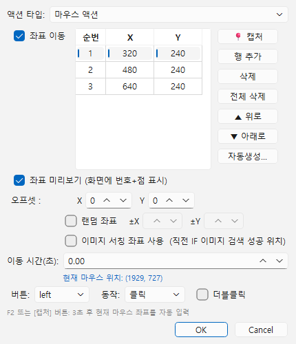
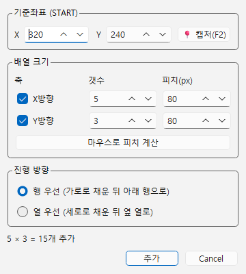
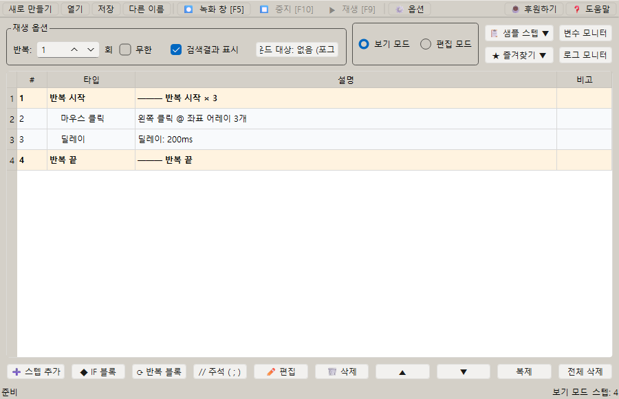

# [사용자 매뉴얼] 5. 반복: 좌표 순서대로 클릭하는 매크로 만들기

## 반복

## 문서 이동

| 구분 | 문서 |
| --- | --- |
| 목록 | [[사용자 매뉴얼] 0. 목록](https://plcman.tistory.com/211) |
| 이전 | [[사용자 매뉴얼] 4. 조건](https://plcman.tistory.com/217) |
| 다음 | [[사용자 매뉴얼] 6. 포인터](https://plcman.tistory.com/219) |
| 관련 | [[사용자 매뉴얼] 7. 변수와 연산](https://plcman.tistory.com/220) |

## 반복 스텝이란?

반복 스텝은 여러 스텝을 묶어서 원하는 횟수만큼 다시 실행하는 기능입니다.
같은 버튼을 여러 번 누르는 반복 클릭이나, 정해진 절차를 되풀이하는 반복 작업 자동화를 코드 없이 구성할 수 있습니다.

같은 입력을 여러 번 반복하거나, 변수 값을 조금씩 바꾸며 여러 항목을 처리할 때 사용합니다.

## 기본 구조

반복은 시작과 끝이 한 쌍입니다.

```text
반복 시작
  반복할 스텝
반복 끝
```

반복 시작 스텝에 반복 횟수를 입력하면 그 안의 스텝이 지정한 횟수만큼 실행됩니다.

## 예시 1: 같은 버튼을 5번 누르기

1. 반복 시작 스텝을 추가하고 반복 횟수를 `5`로 설정합니다.
2. 마우스 클릭 스텝을 반복 안에 넣습니다.
3. 필요하면 클릭 뒤에 짧은 딜레이를 넣습니다.
4. 반복 끝 스텝을 추가합니다.

## 예시 2: 변수와 함께 반복하기

반복마다 값이 바뀌는 변수를 사용하면 매번 다른 결과를 만들 수 있습니다.

1. 변수 `N`을 만들고 초기값을 `001`로 설정합니다.
2. 반복 시작 스텝을 추가합니다.
3. 텍스트 입력 스텝에 변수 `N`을 사용한 문자열을 입력합니다.
4. 변수 계산 스텝으로 `N`을 1 증가시킵니다.
5. 반복 끝 스텝을 추가합니다.

변수 선언과 텍스트 입력에서 변수를 사용하는 방법은 [[사용자 매뉴얼] 7. 변수와 연산](https://plcman.tistory.com/220)에서 자세히 다룹니다.

## 예시 3: 중첩 반복

반복 안에 또 다른 반복을 넣을 수 있습니다.

예를 들어 바깥 반복은 행을 바꾸고, 안쪽 반복은 열을 바꾸는 식으로 구성할 수 있습니다.

처음에는 반복 횟수를 작게 잡아 테스트한 뒤 실제 횟수로 늘리는 것이 좋습니다.

## 예시 4: 좌표 어레이와 함께 사용

반복 실행 중 좌표 어레이가 있는 마우스 스텝을 만나면 반복 회차에 따라 좌표가 순서대로 적용됩니다.

좌표가 한 개뿐이면 반복 횟수와 상관없이 같은 위치를 계속 사용합니다.
좌표가 여러 개이면 1회차는 첫 번째 좌표, 2회차는 두 번째 좌표를 사용하며, 좌표가 반복 횟수보다 적으면 처음부터 다시 순환합니다.

### 좌표 입력 화면

마우스 스텝을 편집하면 좌표를 입력하는 테이블이 나타납니다. 기본으로 1행(단일 좌표)이 있고, 행을 추가하면 좌표 어레이가 됩니다.

테이블 위의 버튼으로 다음 작업을 할 수 있습니다.

| 버튼 | 기능 |
| --- | --- |
| 캡처 (F2) | 화면에서 좌표를 직접 찍어 입력합니다. 버튼을 누른 뒤 3초 안에 원하는 위치를 클릭하거나, F2를 눌러 즉시 캡처합니다. |
| 행 추가 (F3) | 좌표 행을 하나 추가합니다. F3을 눌러도 빠르게 추가할 수 있습니다. |
| 삭제 (Del) | 선택한 행을 삭제합니다. 여러 행을 선택하면 한 번에 삭제됩니다. |
| 전체 삭제 | 모든 좌표 행을 한 번에 지웁니다. |
| 위로 (Alt+↑) / 아래로 (Alt+↓) | 선택한 행의 순서를 바꿉니다. 여러 행을 선택하면 블록 이동이 됩니다. |
| 자동생성 | 기준 좌표와 간격(피치)을 입력해 격자 좌표를 자동으로 만듭니다. |

**여러 행 선택**

좌표 행을 여러 개 선택해 한 번에 삭제하거나 이동할 수 있습니다.

| 방법 | 동작 |
| --- | --- |
| Ctrl+A | 모든 행 전체 선택 |
| Shift+클릭 | 처음 선택한 행부터 클릭한 행까지 연속 선택 |
| Ctrl+클릭 | 떨어진 행을 개별 추가 선택 |
| Shift+↑↓ | 키보드로 연속 선택 범위 확장 |

**좌표 미리보기**

테이블 위의 "좌표 미리보기" 체크박스를 켜면 입력한 좌표 위치를 화면에 번호와 점으로 실시간으로 확인할 수 있습니다.
좌표가 올바른 위치에 있는지 편집 중에 바로 확인할 때 유용합니다.


<!--kage [##_Image|kage@bUDUlQ/dJMcaaMeFft/AAAAAAAAAAAAAAAAAAAAAP2CPlrrLNVKOlj7Temeysmj4MwMUZKeUQhOKnIp4Gai/img.png?credential=yqXZFxpELC7KVnFOS48ylbz2pIh7yKj8&amp;expires=1782831599&amp;allow_ip=&amp;allow_referer=&amp;signature=PpPCD6YgERF7h7rpLCKsopzB3ME%3D|CDM|1.3|{"originWidth":430,"originHeight":500,"style":"alignCenter"}_##]-->

### 좌표 자동생성

좌표가 격자 형태로 배열되어 있다면 자동생성 기능으로 한 번에 만들 수 있습니다.

**자동생성을 열려면**: 테이블 위의 "자동생성" 버튼을 클릭합니다.

**입력 항목:**

- **기준 좌표**: 격자의 시작 지점입니다. 화면에서 직접 찍거나 수치를 입력합니다.
- **X 갯수 / Y 갯수**: 가로·세로 방향으로 몇 개를 만들지 지정합니다. 한 방향을 비활성화하면 1줄만 만들어집니다.
- **X 피치 / Y 피치**: 좌표 사이의 간격(픽셀)입니다. 음수로 입력하면 전개 방향이 반대가 됩니다. 예를 들어 X 피치를 음수로 설정하면 오른쪽이 아니라 왼쪽으로 좌표가 늘어납니다.
- **채우기 순서**: 좌표를 채워가는 방식입니다. 행 우선(1 2 3 / 4 5 6 / 7 8 9)은 가로를 먼저 채우고, 열 우선(1 4 7 / 2 5 8 / 3 6 9)은 세로를 먼저 채웁니다.
- **생성 모드**: 좌표를 배열하는 방식입니다.
  - **지그재그**: 기본값입니다. 모든 행이 같은 방향으로 좌표를 채웁니다.
  - **스네이크**: 왕복 방식입니다. 짝수 행은 방향이 반전되어 홀수 행과 반대로 채워집니다. 격자를 위에서 아래로 지그재그 없이 훑는 동선에 맞습니다. 1줄(1D) 배열에서는 지그재그와 동일하게 동작합니다.

**마우스로 피치 계산(F3)**: 피치를 직접 계산하기 어려울 때 이 버튼을 사용합니다.
버튼을 누른 뒤 화면에서 끝점을 클릭하면, 기준 좌표와 끝점 사이의 거리를 갯수에 맞춰 피치로 자동 계산합니다.
F3을 눌러도 즉시 시작할 수 있습니다(버튼 클릭 시에는 3초 카운트다운 유지).

생성 가능한 최대 좌표 수는 2000개입니다.

**자동생성 미리보기**: 자동생성 창에서 값을 바꾸면 생성될 격자가 화면에 실시간으로 표시됩니다. 실제로 생성하기 전에 위치를 확인할 수 있습니다.


<!--kage [##_Image|kage@5OVkN/dJMcadB6PcJ/AAAAAAAAAAAAAAAAAAAAALaIcrKDvEdPn8bj18r7PQznjzksTbu0dolMqYUytGSI/img.png?credential=yqXZFxpELC7KVnFOS48ylbz2pIh7yKj8&amp;expires=1782831599&amp;allow_ip=&amp;allow_referer=&amp;signature=cSAwVCwKuMlfGW92AZJYfLtHwXg%3D|CDM|1.3|{"originWidth":360,"originHeight":400,"style":"alignCenter"}_##]-->

예시: 가로 5개, 세로 3개 격자를 80픽셀 간격으로 생성하기

1. "자동생성" 버튼을 클릭합니다.
2. 기준 좌표를 격자의 왼쪽 위 첫 번째 위치로 설정합니다.
3. X 갯수를 `5`, Y 갯수를 `3`으로 입력합니다.
4. X 피치를 `80`, Y 피치를 `80`으로 입력합니다.
5. 채우기 순서는 "행 우선"을 선택합니다.
6. 미리보기로 위치를 확인한 뒤 확인 버튼을 누릅니다.
7. 15개의 좌표가 테이블에 추가됩니다.

이후 반복 스텝을 15회로 설정하면 각 위치를 차례로 클릭할 수 있습니다.


<!--kage [##_Image|kage@b3Me3z/dJMcabq7vN3/AAAAAAAAAAAAAAAAAAAAAHF9zMUpvPJHAZyKXKljfCB4lHr_GSgzfAejLid9AkRZ/img.png?credential=yqXZFxpELC7KVnFOS48ylbz2pIh7yKj8&amp;expires=1782831599&amp;allow_ip=&amp;allow_referer=&amp;signature=1ekoQM9y6To%2FPQGJV8T7SojXPUA%3D|CDM|1.3|{"originWidth":900,"originHeight":580,"style":"alignCenter"}_##]-->

## 변수 초기화 주의

변수 설정 스텝에는 반복 시 초기화 여부가 있습니다.

- 초기화 켜짐: 반복마다 초기값으로 돌아감
- 초기화 꺼짐: 이전 반복에서 바뀐 값을 유지

> [!TIP]
> 번호를 계속 증가시키는 변수는 초기화를 끄는 편이 맞는 경우가 많습니다.

자세한 내용은 [[사용자 매뉴얼] 7. 변수와 연산](https://plcman.tistory.com/220)을 참조합니다.

## 관련 문서

- 반복 안에서 공통 절차를 묶어 재사용하려면 [[사용자 매뉴얼] 6. 포인터](https://plcman.tistory.com/219) 문서를 참고하세요.
- 반복마다 번호나 값을 바꿔 가며 입력하려면 [[사용자 매뉴얼] 7. 변수와 연산](https://plcman.tistory.com/220) 문서를 참고하세요.
- 프로그램 다운로드와 전체 기능 소개는 [JP's Codeless Macro Tool 다운로드·배포 안내](https://plcman.tistory.com/209)에서 볼 수 있습니다.
- 전체 매뉴얼 목차는 [[사용자 매뉴얼] 0. 목록](https://plcman.tistory.com/211)에서 볼 수 있습니다.

## 다음에 읽을 문서

- 이전: [[사용자 매뉴얼] 4. 조건](https://plcman.tistory.com/217)
- 다음: [[사용자 매뉴얼] 6. 포인터](https://plcman.tistory.com/219)
