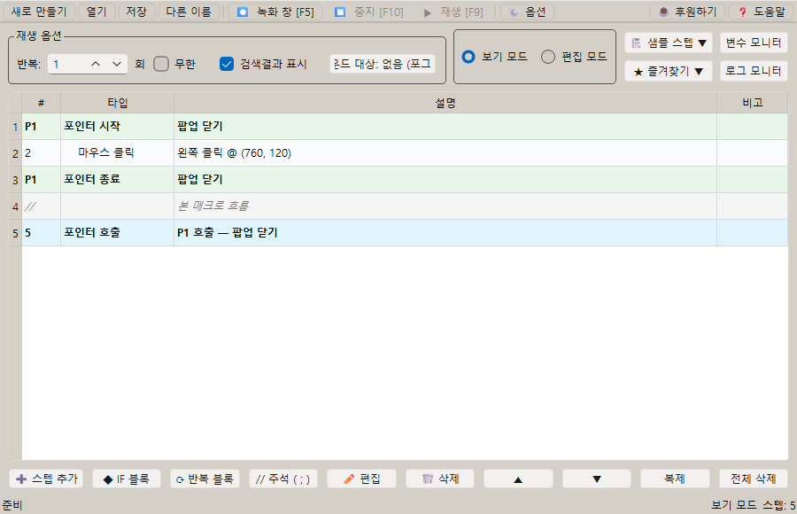
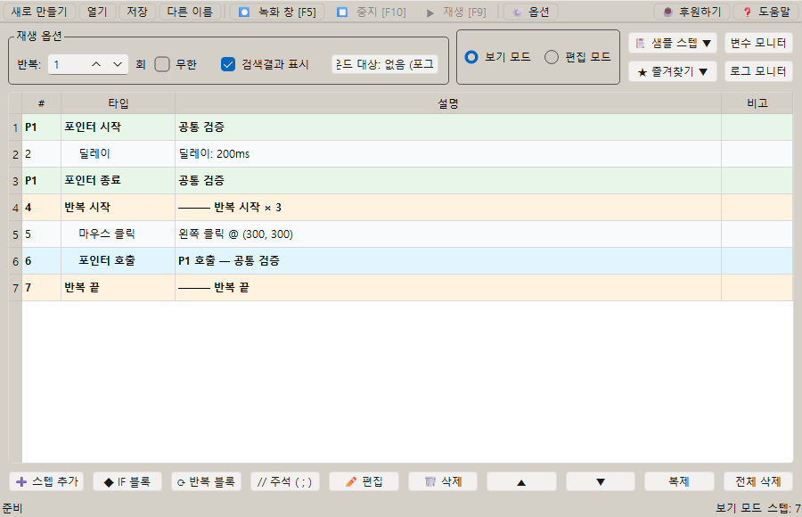

# [사용자 매뉴얼] 6. 포인터: 좌표 묶음을 재사용하는 포인터 기능

## 포인터

## 문서 이동

| 구분 | 문서 |
| --- | --- |
| 목록 | [[사용자 매뉴얼] 0. 목록](https://plcman.tistory.com/211) |
| 이전 | [[사용자 매뉴얼] 5. 반복](https://plcman.tistory.com/218) |
| 다음 | [[사용자 매뉴얼] 7. 변수와 연산](https://plcman.tistory.com/220) |
| 관련 | [[사용자 매뉴얼] 4. 조건](https://plcman.tistory.com/217) |

## 포인터란?

포인터는 자주 쓰는 스텝 묶음을 정의해 두고, 필요한 위치에서 다시 호출하는 기능입니다.

같은 팝업 닫기, 같은 저장 절차, 같은 확인 절차를 여러 곳에서 반복해서 써야 할 때 유용합니다.

## 기본 구조

포인터는 정의 구간과 호출 스텝으로 나뉩니다.

```text
포인터 시작
  재사용할 스텝
포인터 종료

포인터 호출
```

포인터 호출을 만나면 정의된 스텝 묶음이 실행되고, 호출 다음 위치로 돌아옵니다.


<!--kage [##_Image|kage@O8K1h/dJMcacwNnIB/AAAAAAAAAAAAAAAAAAAAALFP39vjFGwUaNv7K9zGz0x-kg08d_qytrWgclqTuBFb/img.png?credential=yqXZFxpELC7KVnFOS48ylbz2pIh7yKj8&amp;expires=1782831599&amp;allow_ip=&amp;allow_referer=&amp;signature=kLjS9twJtleNKDNfJVdgDpgds%2Fw%3D|CDM|1.3|{"originWidth":900,"originHeight":580,"style":"alignCenter"}_##]-->

## 예시 1: 공통 팝업 닫기

1. 포인터 시작 스텝을 추가합니다.
2. 팝업 이미지 조건을 넣습니다.
3. 조건 안에 닫기 버튼 클릭 스텝을 넣습니다.
4. 포인터 종료 스텝을 추가합니다.
5. 긴 매크로 흐름 중 팝업이 생길 수 있는 위치마다 포인터 호출을 넣습니다.

팝업 닫기 방식이 바뀌면 포인터 정의 구간만 수정하면 됩니다.

## 예시 2: 저장 후 대기 흐름 재사용

1. 포인터 시작 스텝을 추가합니다.
2. 키보드 액션 `ctrl+s`를 넣습니다.
3. 딜레이 스텝을 넣습니다.
4. 포인터 종료 스텝을 추가합니다.
5. 저장이 필요한 여러 위치에 포인터 호출을 넣습니다.

## 예시 3: 반복 안에서 공통 작업 호출

반복문 안에서도 포인터 호출을 사용할 수 있습니다.

예를 들어 각 행을 처리할 때마다 같은 검증 절차를 호출하도록 구성할 수 있습니다.

```text
반복 시작
  행 클릭
  포인터 호출: 공통 검증
반복 끝
```


<!--kage [##_Image|kage@rpF43/dJMcaicKU9k/AAAAAAAAAAAAAAAAAAAAANz8lNfebdjL2KmC_3fZGiQ7RgElPe3oOqV6TRw0IL2d/img.png?credential=yqXZFxpELC7KVnFOS48ylbz2pIh7yKj8&amp;expires=1782831599&amp;allow_ip=&amp;allow_referer=&amp;signature=L3wq3%2FXM5VE8yf0lDl0kaNj5%2BWc%3D|CDM|1.3|{"originWidth":900,"originHeight":580,"style":"alignCenter"}_##]-->

## 포인터 안에서 조건 탈출(BREAK) 사용 시 주의

포인터 정의(`포인터 시작 ~ 포인터 종료`) 안에서 조건 탈출(BREAK)을 사용하면, BREAK는 포인터 경계에서 흡수됩니다.

> [!NOTE]
> 즉, 포인터 안의 BREAK는 포인터 실행을 종료하고 **포인터 호출 다음 스텝부터 계속 실행**됩니다. 포인터를 호출한 쪽의 조건 블록이나 반복 블록에는 영향을 주지 않습니다.

예시:

```text
포인터 시작: 팝업 닫기
  조건 시작 (오류 이미지 발견됨)
    오류 처리 스텝
    조건 탈출 (BREAK)  ← 포인터 안의 조건 블록만 빠져나옴
  조건 끝
  닫기 버튼 클릭
포인터 종료

반복 시작 (10회)
  포인터 호출: 팝업 닫기  ← BREAK의 영향을 받지 않음
  다음 작업              ← BREAK 이후에도 여기서 계속 실행
반복 끝
```

위 예시에서 포인터 안의 BREAK가 실행되면 포인터 정의 안의 나머지 스텝(닫기 버튼 클릭)은 건너뛰고, 포인터 호출 다음인 `다음 작업`부터 이어서 실행됩니다.
반복 자체는 중단되지 않습니다.

**포인터 호출 쪽의 조건 블록이나 반복 블록에서 BREAK 효과를 보고 싶으면, BREAK 스텝을 포인터 밖(IF 또는 반복 블록 안)에 직접 작성해야 합니다.**

## 작성 팁

- 포인터는 짧고 자주 반복되는 흐름에 사용합니다.
- 너무 긴 전체 업무 흐름을 포인터로 만들면 수정 위치를 찾기 어려워질 수 있습니다.
- 포인터 이름이나 주석에는 역할을 알아볼 수 있는 설명을 남깁니다.
- 조건과 함께 쓰면 팝업 처리나 예외 처리 흐름을 깔끔하게 분리할 수 있습니다.

## 관련 문서

- 반복 구간 안에서 포인터를 호출하려면 [[사용자 매뉴얼] 5. 반복](https://plcman.tistory.com/218) 문서를 참고하세요.
- 조건 분기와 함께 팝업·예외 처리를 묶으려면 [[사용자 매뉴얼] 4. 조건](https://plcman.tistory.com/217) 문서를 참고하세요.
- 프로그램 다운로드와 전체 기능 소개는 [JP's Codeless Macro Tool 다운로드·배포 안내](https://plcman.tistory.com/209)에서 볼 수 있습니다.
- 전체 매뉴얼 목차는 [[사용자 매뉴얼] 0. 목록](https://plcman.tistory.com/211)에서 볼 수 있습니다.

## 다음에 읽을 문서

- 이전: [[사용자 매뉴얼] 5. 반복](https://plcman.tistory.com/218)
- 다음: [[사용자 매뉴얼] 7. 변수와 연산](https://plcman.tistory.com/220)
