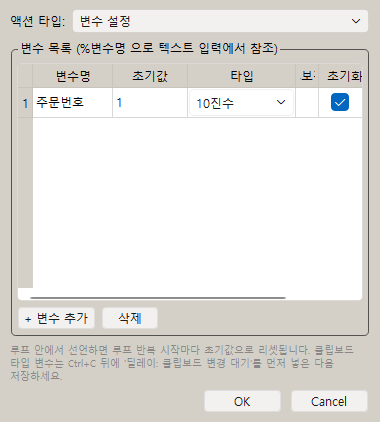
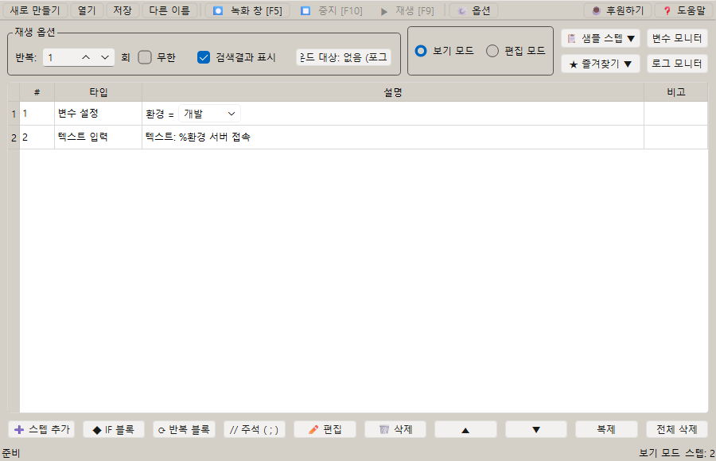
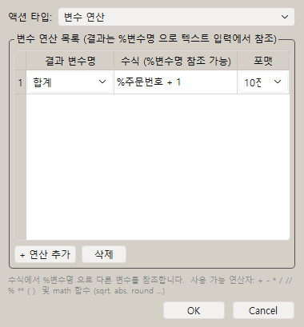
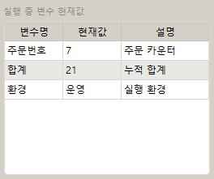

# [사용자 매뉴얼] 7. 변수와 연산: 변수 사용하는 매크로 만들기

## 문서 이동

| 구분 | 문서 |
| --- | --- |
| 목록 | [[사용자 매뉴얼] 0. 목록](https://plcman.tistory.com/211) |
| 이전 | [[사용자 매뉴얼] 6. 포인터](https://plcman.tistory.com/219) |
| 다음 | [[사용자 매뉴얼] 8. 이미지 검색과 캡처](https://plcman.tistory.com/221) |
| 관련 | [[사용자 매뉴얼] 11. 정규식 추출](https://plcman.tistory.com/224) |

## 변수란?

변수는 매크로 실행 중 값을 저장하고 다시 사용하는 기능입니다.

반복마다 숫자를 올리거나, 텍스트 일부를 바꾸거나, 계산 결과를 다음 스텝에서 사용할 수 있습니다.
정규식 추출 스텝을 사용하면 원본 문자열에서 필요한 부분만 뽑아 새 변수에 저장할 수도 있습니다.

## 변수 설정

변수 설정 스텝에서 변수 이름, 초기값, 형식을 정합니다.

편집창을 열면 아래 항목을 설정할 수 있습니다.

| 항목 | 설명 |
| --- | --- |
| 변수명 | 변수를 부르는 이름입니다. 텍스트 입력이나 수식에서 `%변수명`으로 참조합니다. |
| 초기값 | 매크로가 시작될 때 변수에 들어가는 첫 값입니다. |
| 타입(포맷) | 값을 어떤 방식으로 해석하고 표시할지 선택합니다. |
| 후보값 | 선택형 변수로 만들 때 쓰는 값 목록입니다(아래 설명). |
| 반복 시 초기화 | 반복 스텝 안에서 변수를 쓸 때 매 반복마다 초기값으로 돌아갈지 여부를 선택합니다. |

### 타입(포맷)

변수에 저장되는 값의 형식을 지정합니다.

| 타입 | 설명 | 예 |
| --- | --- | --- |
| 10진수 | 일반 숫자 | `42` |
| 16진수 | 16진수 숫자 | `2A` |
| 8진수 | 8진수 숫자 | `52` |
| 텍스트 | 숫자 계산 없이 문자 그대로 사용 | `사과` |
| 클립보드 | 실행 시점의 시스템 클립보드 내용을 읽어 저장 | — |

숫자 타입(10진수·16진수·8진수)은 변수 계산 스텝에서 연산에 바로 쓸 수 있습니다.
텍스트 타입은 텍스트 입력 스텝에서만 사용하며 변수 계산 수식에는 적용되지 않습니다.


<!--kage [##_Image|kage@bgiKUh/dJMcaijsNsQ/AAAAAAAAAAAAAAAAAAAAAFgByAkFGeeP09slJmRUlhvNc76zftwaracaIbGMiuWb/img.png?credential=yqXZFxpELC7KVnFOS48ylbz2pIh7yKj8&amp;expires=1782831599&amp;allow_ip=&amp;allow_referer=&amp;signature=a6WleYXugVE6k%2B8XTCzk4tU%2F9yM%3D|CDM|1.3|{"originWidth":380,"originHeight":422,"style":"alignCenter"}_##]-->

## 선택형 변수(드롭박스)

> [!TIP]
> v1.0.49부터 변수에 후보값을 지정하면 메인 화면에서 편집창 없이 드롭박스로 바로 값을 바꿀 수 있습니다.

후보값 칸에 콤마로 값을 나열하면 해당 변수가 **선택형 변수**가 됩니다.

예:

- 글자 후보: `A, B, C`
- 숫자 후보: `10, 20, 30`
- 16진수 후보: `0A, 1F, FF`

선택형 변수로 만들면 메인 화면 변수 행에 드롭박스가 나타납니다.
목록에서 값을 골라 클릭하면 바로 변경되고, 재생 시 선택된 값이 그대로 사용됩니다.

### 후보값 종류에 따른 동작

| 후보 종류 | 변수 계산 | 텍스트 입력 |
| --- | --- | --- |
| 숫자 후보 (설정 타입에 맞는 자릿수) | 사용 가능 | 사용 가능 |
| 글자 후보 (숫자가 아닌 값 포함) | 건너뜀(계산 실행 안 함) | 사용 가능 |

숫자 후보 예시: 타입이 16진수인 변수에 `0A, 1F, FF`를 지정하면 계산에 쓸 수 있습니다.
타입이 16진수인데 후보에 일반 문자가 섞이면 글자 후보로 처리됩니다.

글자 후보 변수가 변수 계산 수식에 포함된 경우, 해당 계산 스텝은 실행되지 않고 넘어갑니다.
텍스트 입력에서는 정상 사용됩니다.

### 선택형 변수 사용 예시

실행 환경(서버, 지역, 부서 등)을 매번 편집창 없이 손쉽게 바꾸는 경우:

1. 변수 설정 스텝에서 변수명 `환경`, 타입 `텍스트`, 후보값 `개발, 테스트, 운영`으로 설정합니다.
2. 메인 화면 변수 행에 드롭박스가 표시됩니다.
3. 드롭박스에서 `테스트`를 선택하면 재생 시 텍스트 입력 스텝이 `테스트`를 입력합니다.


<!--kage [##_Image|kage@nEQoK/dJMcacp3bvY/AAAAAAAAAAAAAAAAAAAAAKsf0f_5GrNt9OO6NdvUI1I5_lr50nXPqwjOb9NIDIkt/img.png?credential=yqXZFxpELC7KVnFOS48ylbz2pIh7yKj8&amp;expires=1782831599&amp;allow_ip=&amp;allow_referer=&amp;signature=DeMU7bAaqOmL8h8a7uu0vYNbfQY%3D|CDM|1.3|{"originWidth":900,"originHeight":580,"style":"alignCenter"}_##]-->

## 반복 시 초기화

반복 시 초기화가 켜진 변수는 반복이 다시 시작될 때 초기값으로 돌아갑니다.

반복 시 초기화가 꺼진 변수는 이전 반복에서 변경된 값을 유지합니다.

예를 들어 번호를 계속 증가시키고 싶다면 초기화를 끄고, 매 반복마다 같은 값에서 시작하고 싶다면 초기화를 켜면 됩니다.

## 클립보드 값을 변수로 저장

변수 설정에서 타입을 `클립보드`로 선택하면 실행 시점의 시스템 클립보드 내용을 변수에 저장합니다.

`Ctrl+C`로 외부 프로그램의 텍스트를 복사한 뒤 변수에 저장하려면 복사 직후에 클립보드 변경 대기를 먼저 넣어야 합니다.

예시: 복사한 텍스트를 `복사` 변수에 저장하는 경우

1. 키보드 액션으로 `ctrl+c`를 실행합니다.
2. 딜레이 스텝에서 `클립보드 변경 대기`를 선택합니다.
3. 변수 설정 스텝에서 변수명은 `복사`, 타입은 `클립보드`로 설정합니다.

> [!WARNING]
> 순서를 `ctrl+c → 변수 설정 → 클립보드 변경 대기`로 만들면 클립보드 갱신 전에 변수가 먼저 저장되어 이전 값이 들어갈 수 있습니다. 반드시 `ctrl+c → 클립보드 변경 대기 → 변수 설정` 순서를 지키세요.

## 텍스트 입력에서 변수 사용

텍스트 입력 스텝에서 변수 값을 넣어 자동으로 다른 문장을 만들 수 있습니다.

텍스트 입력 칸에서 `%`를 입력하면 사용할 수 있는 변수를 선택하는 팝업이 표시됩니다.

예:

```text
항목%N
```

변수 `N`의 값이 `001`이면 실행 시 `항목001`처럼 입력됩니다.

예시: 번호가 붙은 품목명을 자동 입력하는 경우

1. 변수 `N`을 만들고 타입은 `10진수`, 초기값은 `001`로 설정합니다.
2. 텍스트 입력 스텝에 `품목-%N`을 입력합니다.
3. 입력 후 변수 계산 스텝으로 `N`을 1 증가시킵니다.
4. 반복 실행하면 `품목-001`, `품목-002`, `품목-003`처럼 입력됩니다.

변수명이 긴 것부터 먼저 매칭됩니다. 예를 들어 변수 `주문번호`와 `주문`이 모두 선언된 경우, `%주문번호`는 `주문번호` 변수로 정확하게 치환됩니다.

## 변수 바꾸기

변수 바꾸기 스텝은 원본 문자열에서 특정 문자를 찾아 다른 문자로 바꿉니다.

원본 변수와 저장 변수를 따로 선택할 수 있습니다.
같은 변수를 선택하면 기존처럼 원본 값을 바로 바꾸고, 다른 변수를 선택하면 원본은 유지한 채 결과만 새 변수에 저장합니다.

클립보드를 원본이나 저장 대상으로 선택할 수도 있습니다.
예를 들어 클립보드에 복사된 문장에서 불필요한 공백을 정리해 다시 클립보드에 저장하는 흐름을 만들 수 있습니다.

하나의 변수 바꾸기 스텝에 여러 치환 규칙을 등록할 수 있습니다.

| 항목 | 설명 |
| --- | --- |
| 검색 문자 | 원본에서 찾을 문자열입니다. 비워 두면 저장할 수 없습니다. |
| 바꿀 문자 | 검색 문자를 바꿀 문자열입니다. 비워 두면 해당 문자열을 삭제하는 효과가 납니다. |
| 실행 순서 | 테이블 위 행부터 아래 행까지 순서대로 적용됩니다. |
| 행 조작 | `+ 치환 추가`, 삭제, 위로, 아래로 버튼을 사용합니다. |
| 단축키 | 선택한 행은 `Alt+위/아래`로 이동하고 `Delete`로 삭제할 수 있습니다. |

검색 문자와 바꿀 문자에는 일반 문자열과 `%변수명`을 모두 사용할 수 있습니다.
`%`를 입력하면 선언된 변수가 있을 때 변수 선택 팝업이 표시됩니다.
선언된 변수가 없으면 `%`는 그대로 입력됩니다.

예시: 복사한 텍스트를 한 번에 정리하는 경우

| 순서 | 검색 문자 | 바꿀 문자 |
| --- | --- | --- |
| 1 | 공백 | `_` |
| 2 | `주문번호:` | `ORDER=` |
| 3 | `%삭제대상` | (비워 둠) |

위 예시는 공백을 밑줄로 바꾼 뒤, `주문번호:` 문구를 `ORDER=`로 바꾸고, `%삭제대상` 변수에 들어 있는 문자열은 삭제합니다.

예시: 복사한 텍스트의 공백을 밑줄로 바꾸는 경우

1. 키보드 액션으로 `ctrl+c`를 실행합니다.
2. 딜레이 스텝에서 클립보드 변경 대기를 선택합니다.
3. 변수 바꾸기 스텝의 원본을 `클립보드`로 선택합니다.
4. 치환 목록 첫 행의 검색 문자는 공백, 바꿀 문자는 `_`로 입력합니다.
5. 저장 대상도 `클립보드`로 선택합니다.

원본 변수와 저장 변수는 항상 드롭박스로 선택합니다. 선언된 변수가 없어도 드롭박스를 열어 `클립보드`를 선택할 수 있으며, 기본값은 아무것도 선택되지 않은 상태입니다.

## 변수 계산

변수 계산 스텝은 변수 값을 계산해 바꿉니다.

대표적으로 다음 작업을 할 수 있습니다.

- 숫자 증가 또는 감소
- 사칙연산, 나머지 계산, 거듭제곱
- 계산 결과를 다른 변수에 저장
- 계산 결과를 시스템 클립보드에 복사

수식 입력 칸에서 `%`를 입력하면 선언된 변수 선택 팝업이 표시됩니다. 예를 들어 `%COUNT + 1`처럼 다른 변수 값을 참조하는 수식을 쉽게 만들 수 있습니다.

### 사용 가능한 연산자

| 연산자 | 설명 | 예 |
| --- | --- | --- |
| `+` `-` `*` `/` | 사칙연산 | `%N + 1` |
| `//` | 정수 나누기(몫만) | `%N // 3` |
| `%` | 나머지 | `%N % 10` |
| `**` | 거듭제곱 | `%N ** 2` |
| `++` | 1 증가 단축 표기 | `++` |
| `--` | 1 감소 단축 표기 | `--` |

`++`와 `--`는 수식 칸에 그대로 입력하면 됩니다.
결과 대상 변수를 자동으로 1 올리거나 내립니다.

`sin`, `cos`, `sqrt`, `abs` 같은 수학 함수도 수식에 쓸 수 있습니다.

> **16진수 변수를 계산에 쓸 때 참고**
> 변수 계산 수식(`%변수`)은 값 문자열에 `0x` 접두사가 있으면 16진수로, 없으면 10진수로 해석합니다. 그래서 OCR 텍스트 읽기·정규식 추출처럼 **화면에서 읽어 채운 값**을 16진수로 계산하려면 소스 값에 `0x` 접두사가 포함되어야 합니다. 예를 들어 화면에서 읽은 값이 `10`이면 10진수 10으로 계산되고, `0x10`이면 16진수 16으로 계산됩니다. 16진수로 다루려는 값은 `0x`를 붙여 두는 것을 권장합니다.

### 결과 대상

계산 결과를 저장할 대상을 선택합니다.

- **일반 변수**: 계산 결과를 지정한 변수에 저장합니다. 변수 모니터에서 값을 확인할 수 있습니다.
- **클립보드**: 계산 결과를 시스템 클립보드에 복사합니다. 변수 상태에는 저장되지 않으므로 변수 모니터에 표시되지 않습니다.

결과 대상의 기본값은 선택되지 않은 상태입니다. 대상이 비어 있으면 앱이 경고를 표시하고 저장을 차단합니다.

### 계산 결과 포맷

계산 결과의 숫자 표시 방식은 결과 대상 변수의 선언 포맷을 따릅니다.

예를 들어 결과 대상 변수 `CODE`가 16진수로 선언되어 있으면, 계산 결과도 16진수로 표시됩니다.
변수 계산 스텝에서 포맷을 별도로 지정할 수 없으며, 항상 변수 선언 포맷이 기준입니다.

결과 대상이 `클립보드`인 경우 포맷은 항상 10진수로 복사됩니다.

예시: 계산 결과를 바로 붙여넣는 경우

1. 변수 `COUNT`에 현재 번호를 저장합니다.
2. 변수 계산 스텝에서 수식을 `%COUNT + 1`로 입력합니다.
3. 결과 대상을 `클립보드`로 선택합니다.
4. 다음 스텝에서 `ctrl+v`를 실행해 계산 결과를 입력합니다.

> [!NOTE]
> 글자(텍스트) 타입의 변수 또는 글자 후보를 가진 선택형 변수는 변수 계산 수식에서 사용할 수 없습니다. 해당 변수가 수식에 포함된 경우 그 계산 스텝은 실행되지 않고 넘어가며, 로그 모니터에 건너뜀 사유가 표시됩니다.


<!--kage [##_Image|kage@2YP4O/dJMcahdOly8/AAAAAAAAAAAAAAAAAAAAAHHp7lugBfe_gWA1kydumAd8mLQNZprniutzM0gfZ-Rz/img.png?credential=yqXZFxpELC7KVnFOS48ylbz2pIh7yKj8&amp;expires=1782831599&amp;allow_ip=&amp;allow_referer=&amp;signature=KJihIaj5otPkM3t9HYwKxtB86hM%3D|CDM|1.3|{"originWidth":380,"originHeight":409,"style":"alignCenter"}_##]-->

## 변수 모니터

변수 모니터를 사용하면 실행 중 변수 값이 어떻게 바뀌는지 실시간으로 확인할 수 있습니다.

매크로가 예상과 다르게 동작할 때 변수 값, 계산 결과, 정규식 추출 결과를 확인하면 원인을 찾는 데 도움이 됩니다.

### 변수 모니터에서 바로 편집 (v1.0.49)

변수 모니터 창에서 변수를 더블클릭하면 해당 변수의 편집창이 바로 열립니다.

| 더블클릭 위치 | 열리는 편집창 |
| --- | --- |
| 변수명·값 열 | 변수 설정 편집(초기값, 타입, 후보값 등) |
| 설명 열 | 변수 연산 또는 정규식 추출 편집 |

더블클릭으로 연산이나 추출 스텝을 편집한 뒤 저장하면 매크로에 바로 반영됩니다.

### 실시간 갱신 (v1.0.49)

변수를 추가하거나 삭제하거나 수정하면 변수 모니터 목록과 설명이 즉시 갱신됩니다.
드롭박스에서 선택값을 바꿔도 즉시 반영됩니다.

변수 설명에는 선택값·초기값·연산식이 함께 표시됩니다.


<!--kage [##_Image|kage@bwNXMh/dJMcahdOlAl/AAAAAAAAAAAAAAAAAAAAAKqOMBN7Zc2Ruh75gix1dnoMUspri7zgRy4-bMk-7Bwo/img.png?credential=yqXZFxpELC7KVnFOS48ylbz2pIh7yKj8&amp;expires=1782831599&amp;allow_ip=&amp;allow_referer=&amp;signature=7LXOs0Rd6GUYiJJizAWAJOjz9tI%3D|CDM|1.3|{"originWidth":264,"originHeight":221,"style":"alignCenter"}_##]-->

## 정규식 추출

정규식 추출 스텝은 원본 변수에 저장된 문자열에서 필요한 부분만 찾아 다른 변수에 저장하는 기능입니다.

예를 들어 `주문번호: A-1024 / 금액: 35000원` 같은 문자열에서 주문번호나 금액만 따로 뽑아 다음 스텝에서 사용할 수 있습니다.

정규식은 처음 접하면 어렵게 느껴질 수 있으므로 별도 문서에서 예시 중심으로 설명합니다.

- 자세한 설명: [[사용자 매뉴얼] 11. 정규식 추출](https://plcman.tistory.com/224)

## %변수명 입력 팝업

다음 입력 위치에서는 `%`를 입력했을 때 선언된 변수가 있으면 변수 선택 팝업이 표시됩니다.

| 위치 | 사용 예 |
| --- | --- |
| 텍스트 입력 | `주문번호: %주문번호` |
| 변수 바꾸기 검색 문자/바꿀 문자 | `%삭제대상`을 찾아 빈 문자열로 바꾸기 |
| 변수 계산 수식 | `%COUNT + 1` |
| 조건 시작(IF) 변수 값 비교의 비교대상 | `%기준값`과 비교 |
| 정규식 추출 원본/저장 필드 | `%원본문자열`, `%추출결과` 입력 보조 |

선언된 변수가 없으면 팝업은 표시되지 않고 `%` 문자가 그대로 남습니다.
일반 문자열로 `%`를 써야 하는 경우에도 직접 입력해 사용할 수 있습니다.

## 자주 하는 실수

- **클립보드 변경 대기 누락**: `ctrl+c` 직후 바로 클립보드 변수를 읽으면 이전 클립보드 값이 저장될 수 있습니다. 딜레이 스텝의 `클립보드 변경 대기`를 반드시 중간에 넣으세요.
- **글자 타입 변수를 계산에 사용**: 텍스트 타입이나 글자 후보를 가진 선택형 변수는 변수 계산 수식에서 사용할 수 없습니다. 계산이 필요하면 숫자 타입으로 설정하세요.
- **반복 초기화 설정 확인**: 반복 스텝 안에서 변수를 카운터로 쓸 때, 반복 시 초기화가 켜져 있으면 매 반복마다 초기값으로 돌아갑니다. 값을 계속 누적하려면 초기화를 끄세요.
- **변수 계산 포맷 오해**: 변수 계산 스텝에서 포맷을 바꿔도 계산 결과 표시에 영향을 주지 않습니다. 표시 방식은 결과 대상 변수의 선언 포맷이 결정합니다.

## 관련 문서

- 문자열에서 필요한 값만 뽑아 변수로 저장하려면 [[사용자 매뉴얼] 11. 정규식 추출](https://plcman.tistory.com/224) 문서를 참고하세요.
- 반복마다 변수 값을 증가시키며 작업하려면 [[사용자 매뉴얼] 5. 반복](https://plcman.tistory.com/218) 문서를 참고하세요.
- 조건 분기에서 변수 값을 비교하는 방법은 [[사용자 매뉴얼] 4. 조건](https://plcman.tistory.com/217) 문서를 참고하세요.
- 프로그램 다운로드와 전체 기능 소개는 [JP's Codeless Macro Tool 다운로드·배포 안내](https://plcman.tistory.com/209)에서 볼 수 있습니다.
- 전체 매뉴얼 목차는 [[사용자 매뉴얼] 0. 목록](https://plcman.tistory.com/211)에서 볼 수 있습니다.

## 다음에 읽을 문서

- 이전: [[사용자 매뉴얼] 6. 포인터](https://plcman.tistory.com/219)
- 다음: [[사용자 매뉴얼] 8. 이미지 검색과 캡처](https://plcman.tistory.com/221)
