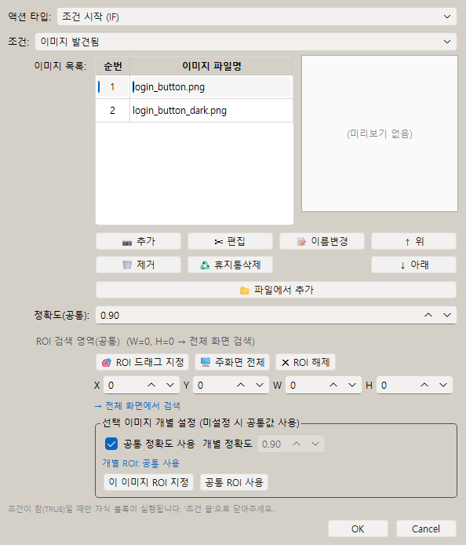
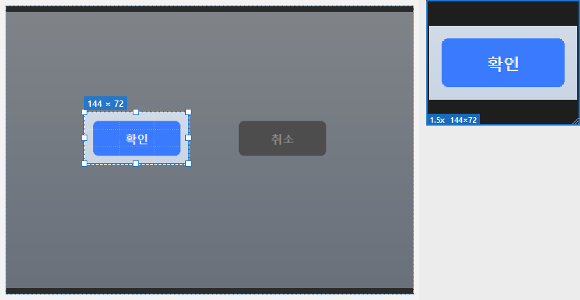

# [사용자 매뉴얼] 8. 이미지 검색과 캡처: 화면 이미지를 찾아 클릭하기

## 이미지 검색과 캡처

## 문서 이동

| 구분 | 문서 |
| --- | --- |
| 목록 | [[사용자 매뉴얼] 0. 목록](https://plcman.tistory.com/211) |
| 이전 | [[사용자 매뉴얼] 7. 변수와 연산](https://plcman.tistory.com/220) |
| 다음 | [[사용자 매뉴얼] 9. 옵션과 단축키](https://plcman.tistory.com/222) |

## 이미지 검색이란?

이미지 검색은 화면에서 지정한 이미지를 찾아 그 위치를 기준으로 동작하는 기능입니다.
화면 속 버튼이나 아이콘을 이미지로 찾아서 자동으로 클릭하거나, 원하는 영역을 화면 캡처해 그 그림이 나타날 때 다음 동작을 실행할 수 있습니다.

버튼 위치가 매번 조금씩 달라지는 프로그램이나 웹 화면에서 유용합니다.

## 이미지 캡처

이미지 조건이나 이미지 클릭을 만들 때는 화면 일부를 캡처해 기준 이미지로 사용합니다.

캡처할 때는 너무 넓은 영역보다 버튼, 아이콘, 글자처럼 구분이 쉬운 부분만 잡는 것이 좋습니다.

## 이미지 조건

이미지 조건은 지정한 이미지가 화면에 있는지 확인합니다.

대표 사용 예:

- 특정 버튼이 보일 때만 클릭
- 로딩이 끝났을 때 다음 단계 실행
- 에러 팝업이 보이면 닫기
- 이미지가 없을 때만 새로고침

예시: 저장 완료 메시지가 보인 뒤 다음 작업 실행

1. 저장 완료 메시지의 고유한 글자나 아이콘을 캡처합니다.
2. 이미지 조건 스텝을 추가하고 해당 이미지가 있는지 확인합니다.
3. 조건 안에 다음 버튼 클릭이나 창 닫기 스텝을 넣습니다.
4. 저장 완료 메시지가 보이지 않으면 내부 스텝은 실행되지 않습니다.

## 여러 이미지 중 하나라도 보이면 (OR 검색)

버튼이나 아이콘이 상황에 따라 여러 모양으로 나타날 때는, 한 조건에 이미지를 여러 장 등록해 "그중 하나라도 보이면"으로 동작하게 할 수 있습니다.

- 이미지 조건 편집창에서 이미지를 여러 장 추가하면 목록으로 정리됩니다.
- 목록의 순서가 검색 우선순위입니다. 위에 있는 이미지부터 차례로 찾습니다.
- 가장 먼저 발견된 이미지의 위치를 클릭 기준으로 사용합니다.
- 등록한 이미지를 모두 찾지 못하면 해당 조건 블록은 실행되지 않습니다.
- "이미지 없음" 조건은 등록한 이미지가 모두 보이지 않을 때만 참이 됩니다.

편집창 사용법:

1. 이미지 조건 스텝을 열면 왼쪽에 이미지 목록, 오른쪽에 미리보기가 있습니다.
2. 추가 버튼으로 새 이미지를 캡처해 목록에 넣습니다. 프로젝트에 이미 저장된 이미지가 있으면 "기존 이미지 추가" 목록에서 골라 넣을 수도 있습니다.
3. 목록에서 항목을 선택하면 미리보기에 해당 이미지가 표시됩니다.
4. 항목을 더블클릭하거나 선택 후 Enter를 누르면 그 이미지를 다시 캡처하거나 자를 수 있습니다.
5. 이름변경으로 파일 이름을 바꾸고, 제거로 목록에서만 빼며, 휴지통삭제로 이미지 파일을 휴지통으로 보냅니다. 위·아래 버튼으로 검색 순서를 바꿉니다.

정확도와 검색 영역은 기본적으로 모든 이미지에 공통으로 적용됩니다.
특정 이미지만 다르게 하고 싶으면, 그 이미지를 선택한 뒤 개별 정확도나 개별 검색 영역을 따로 지정할 수 있습니다.
따로 지정하지 않으면 공통값을 그대로 사용합니다.

검색에 성공하면 찾은 위치에 빨간 테두리가 잠깐 표시됩니다.
이 표시는 위쪽 도구 막대의 "검색결과 표시"로 켜고 끕니다.

> [!NOTE]
> 이미지를 한 장만 등록하면 기존과 똑같이 한 장만 검색합니다. 예전에 만든 매크로도 그대로 동작합니다.

<!--kage [##_Image|kage@Bp3HY/dJMcabkoe5x/AAAAAAAAAAAAAAAAAAAAAJJYw2jdxbDUOdPAW85BmWLs-4qFfTRp9vDdtPgU_fXe/img.png?credential=yqXZFxpELC7KVnFOS48ylbz2pIh7yKj8&amp;expires=1782831599&amp;allow_ip=&amp;allow_referer=&amp;signature=r7fNgv8Asfs3QQRRwTtXMpABLnU%3D|CDM|1.3|{"originWidth":594,"originHeight":694,"style":"alignCenter"}_##]-->

## 이미지 위치 기준 클릭

찾은 이미지의 위치를 기준으로 클릭할 수 있습니다.

이미지 자체를 클릭하거나, 이미지에서 조금 떨어진 위치를 클릭하도록 오프셋을 줄 수 있습니다.

예를 들어 체크박스 옆의 라벨 이미지를 찾고, 실제 클릭은 체크박스 위치에 하도록 설정할 수 있습니다.

예시: 위치가 조금씩 바뀌는 확인 버튼 클릭

1. 확인 버튼의 글자나 아이콘을 캡처합니다.
2. 이미지 위치 기준 클릭 스텝을 추가합니다.
3. 찾은 이미지의 중앙을 클릭하거나 필요한 만큼 오프셋을 조정합니다.
4. 창 위치가 달라져도 이미지가 보이면 해당 위치를 기준으로 클릭합니다.

이미지 위치 기준 클릭/이동은 바로 앞의 "이미지 발견됨" 검색이 성공했을 때만 동작합니다.
검색에 성공하지 못해 기준 위치가 없으면 그 스텝만 건너뛰고 매크로는 멈추지 않고 계속 진행합니다.
따라서 위치 기준 동작은 "이미지 없음" 조건 안이 아니라 "이미지 발견됨" 조건 안에서 사용하세요.

## 이미지 필터링 옵션

이미지 캡처·편집 창의 "이미지 필터링" 그룹에서 이미지별 매칭 옵션을 설정할 수 있습니다.
옵션은 이미지 목록에서 해당 항목을 선택한 뒤 편집(더블클릭 또는 Enter)해서 들어가면 나타납니다.

### 컬러 무시(그레이스케일)

"컬러 무시(그레이스케일)" 체크박스를 켜면 화면과 템플릿 이미지를 모두 흑백으로 변환한 뒤 비교합니다.

이 옵션이 필요한 경우:

- 프로그램 테마(밝음/어두움)가 바뀌어도 같은 버튼을 찾아야 할 때
- 야간 모드나 고대비 모드에서도 매크로가 동작해야 할 때
- 배경 색상이 자주 바뀌지만 버튼 형태는 그대로인 경우

> [!TIP]
> 옵션을 켠 뒤 "화면 검색 테스트" 영역의 "화면에서 찾기" 버튼으로 실제 검색이 잘 되는지 확인해 보세요. 흑백 변환으로 형태는 같지만 같은 색의 다른 요소를 잘못 찾을 수도 있습니다.

### 무시 영역(자유펜 마스크)

이미지에서 매번 바뀌는 부분이 있으면 그 영역을 펜으로 칠해 매칭 대상에서 제외할 수 있습니다.
숫자 표시, 상태 아이콘처럼 형태는 같아도 내용이 달라지는 부분에 유용합니다.

사용 순서:

1. 이미지 목록에서 편집할 이미지를 더블클릭합니다.
2. 편집 화면 상단 도구 막대에서 "✏ 무시영역 펜" 버튼을 누릅니다.
3. 이미지 위에서 마우스 좌클릭을 끌어 제외할 영역을 칠합니다.
4. 잘못 칠한 부분은 마우스 우클릭으로 지울 수 있습니다.
5. 마우스 휠을 올리면 펜이 커지고 내리면 작아집니다 (2~60px 범위).
6. 전체를 처음부터 다시 하려면 "마스크 지우기" 버튼을 누릅니다.

마스크 관련 참고사항:

- 마스크는 이미지별로 저장됩니다. 다른 이미지에는 영향을 주지 않습니다.
- 이미지를 자르기해도 해당 영역의 마스크는 그대로 유지됩니다.
- 마스크를 적용한 이미지는 목록에 마스크 표시(✏)가 나타납니다.

> [!WARNING]
> 무시 영역을 너무 넓게 칠하면 의도하지 않은 위치를 찾을 수 있습니다. 꼭 바뀌는 부분만 좁게 지정하는 것을 권장합니다.

## 정확도 설정

이미지 검색은 정확도 값에 따라 결과가 달라집니다.

v1.0.13 이후 기본 정확도는 더 안정적인 값을 사용하도록 조정되었습니다.

이미지를 너무 못 찾으면 정확도를 조금 낮추고, 비슷한 다른 이미지를 잘못 찾으면 정확도를 높여 보세요.

## 듀얼 모니터 주의

듀얼 모니터 환경에서도 이미지 검색을 사용할 수 있습니다.

다만 처음 설정할 때는 작은 테스트 매크로로 원하는 화면에서 이미지가 잘 잡히는지 확인하는 것이 좋습니다.

## 캡처 영역 조정

이미지를 캡처하는 화면에서는 선택 영역을 마우스로 바로 수정할 수 있습니다.

<!--kage [##_Image|kage@bwSE4X/dJMcaccebRM/AAAAAAAAAAAAAAAAAAAAANicMKFGNCBzMTbx0TaeV_in0nd0pRXmrbYGTtnMgXIm/img.png?credential=yqXZFxpELC7KVnFOS48ylbz2pIh7yKj8&amp;expires=1782831599&amp;allow_ip=&amp;allow_referer=&amp;signature=1p2UHUZ0VqKu%2FEdI1jglzeSC5fk%3D|CDM|1.3|{"originWidth":830,"originHeight":430,"style":"alignCenter"}_##]-->

- **이동**: 선택된 영역 안쪽을 클릭하고 드래그하면 영역 전체를 다른 위치로 옮깁니다.
- **크기 조절**: 영역 모서리나 가장자리에 마우스를 가져가면 방향 화살표 커서가 나타납니다. 드래그하면 그쪽 방향으로 크기가 바뀝니다.
- **확대 미리보기**: 영역을 조정하는 동안 오른쪽 위에 확대 미리보기 팝업이 표시됩니다. 지금 선택한 영역이 어떻게 잡히는지 실제 크기보다 크게 확인할 수 있습니다.

캡처가 끝난 뒤에도 이미지를 다시 편집하려면 이미지 목록에서 해당 항목을 선택하고 더블클릭하거나 Enter 키를 누르면 편집 화면으로 돌아갑니다.

## 캡처 팁

- 배경이 자주 바뀌는 영역은 피합니다.
- 버튼 전체보다 고유한 아이콘이나 글자를 잡는 것이 좋습니다.
- 해상도나 배율이 바뀌면 이미지가 달라질 수 있습니다.
- 너무 작은 이미지는 오탐이나 미탐이 생길 수 있습니다.

## 관련 문서

- 이미지가 보일 때만 클릭하는 조건 분기는 [[사용자 매뉴얼] 4. 조건](https://plcman.tistory.com/217) 문서에서 자세히 다룹니다.
- 녹화로 만든 매크로에 이미지 찾아 클릭을 더하려면 [[사용자 매뉴얼] 3. 녹화와 재생](https://plcman.tistory.com/216) 문서를 참고하세요.
- 프로그램 다운로드와 전체 기능 소개는 [JP's Codeless Macro Tool 다운로드·배포 안내](https://plcman.tistory.com/209)에서 볼 수 있습니다.
- 전체 매뉴얼 목차는 [[사용자 매뉴얼] 0. 목록](https://plcman.tistory.com/211)에서 볼 수 있습니다.

## 다음에 읽을 문서

- 이전: [[사용자 매뉴얼] 7. 변수와 연산](https://plcman.tistory.com/220)
- 다음: [[사용자 매뉴얼] 9. 옵션과 단축키](https://plcman.tistory.com/222)
