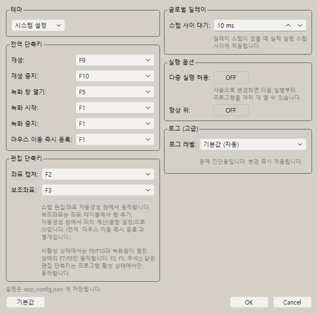
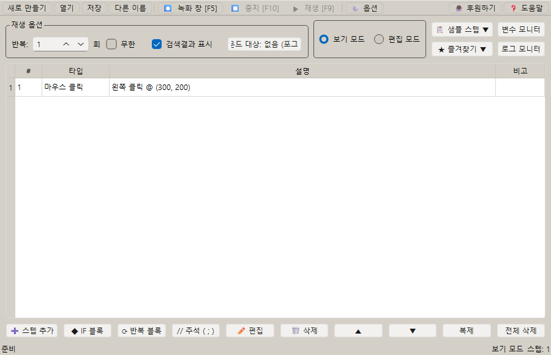

# [사용자 매뉴얼] 9. 옵션과 단축키: 단축키로 매크로 실행·정지하기

## 옵션과 단축키

## 문서 이동

| 구분 | 문서 |
| --- | --- |
| 목록 | [[사용자 매뉴얼] 0. 목록](https://plcman.tistory.com/211) |
| 이전 | [[사용자 매뉴얼] 8. 이미지 검색과 캡처](https://plcman.tistory.com/221) |
| 다음 | [[사용자 매뉴얼] 10. 즐겨찾기](https://plcman.tistory.com/223) |

## 옵션 설정

옵션 창에서 실행과 편집에 필요한 기본값을 조정할 수 있습니다.

설정은 `app_config.json`에 저장됩니다.

<!--kage [##_Image|kage@ce4fAF/dJMcaiqdCRy/AAAAAAAAAAAAAAAAAAAAAJshaB3I_d051R4SJZ7GbGPcnYliKRx5CJbeq-XQrtyU/img.png?credential=yqXZFxpELC7KVnFOS48ylbz2pIh7yKj8&amp;expires=1782831599&amp;allow_ip=&amp;allow_referer=&amp;signature=IAXFfOuwue33UwePnETkG9NmlYM%3D|CDM|1.3|{"originWidth":640,"originHeight":633,"style":"alignCenter"}_##]-->

## 기본 단축키

기본 전역 단축키는 다음과 같습니다.

| 기능 | 기본값 |
| --- | --- |
| 매크로 재생 | F9 |
| 매크로 중지 | F6 |
| 저장 | Ctrl+S |
| 좌표 캡처 | F2 |
| 보조좌표(행 추가·피치 계산) | F3 |

전역 단축키는 프로그램 창이 뒤에 있어도 동작합니다.

`F2`는 마우스 좌표 입력 화면에서 현재 커서 위치를 즉시 입력할 때 사용합니다.
좌표 캡처 버튼을 누르는 경우에는 3초 카운트다운 뒤 현재 위치가 입력됩니다.

`F3`은 좌표 입력 테이블에서 새 행을 빠르게 추가하거나, 좌표 자동생성 화면에서 끝점을 화면에서 직접 클릭해 피치를 계산할 때 사용합니다.
버튼 클릭 시에는 3초 카운트다운이 유지되며, F3을 누르면 즉시 발동합니다.

## 비활성 상태 단축키

매크로 프로그램이 비활성 상태일 때도 동작하는 단축키는 실행 제어 중심으로 제한됩니다.

| 단축키 | 비활성 상태 동작 |
| --- | --- |
| F9 | 재생 시작 허용 |
| F10 | 재생 중지 허용 |
| F7 | 녹화창이 열려 있을 때 녹화 시작 허용 |
| F8 | 녹화창이 열려 있을 때 녹화 중지 허용 |
| F5 | 무시 |
| F2 | 무시 |
| ; | 무시 |

마우스 좌표 빠른등록, 녹화창 열기, 주석 추가처럼 편집 상태를 바꾸는 단축키는 프로그램 창이 활성화된 상태에서만 사용합니다.

## 단축키 변경

다른 프로그램과 단축키가 충돌하면 옵션에서 재생/중지 단축키를 바꿀 수 있습니다.

옵션 창에는 두 개의 단축키 그룹이 있습니다.

- **전역 단축키**: 재생(기본 F9)·중지(기본 F6)·녹화 시작·녹화 중지를 변경합니다. 프로그램이 뒤에 있어도 동작합니다.
- **편집 단축키**: 좌표 캡처(기본 F2)·보조좌표(기본 F3)를 변경합니다. 마우스 스텝 편집 화면이 열려 있을 때만 동작합니다.

업무 프로그램, 게임, 브라우저 확장 프로그램과 같은 키를 쓰면 예상하지 못한 동작이 생길 수 있습니다.

## 키보드 조합키

v1.0.16 이후 키보드 조합키 입력을 지원합니다.

예:

- `ctrl+c`
- `ctrl+v`
- `shift+c`
- `ctrl+alt+delete`

조합키는 키보드 액션 스텝에서 설정합니다.

예시: 복사 후 클립보드 변경을 기다렸다가 붙여넣기

1. 키보드 액션 스텝에 `ctrl+c`를 입력합니다.
2. 딜레이 스텝에서 클립보드 변경 대기를 선택합니다.
3. 키보드 액션 스텝에 `ctrl+v`를 입력합니다.

복사 대상 프로그램의 반응이 느린 경우에도 붙여넣기 실패를 줄일 수 있습니다.

## 글로벌 딜레이

옵션 창의 전역 단축키 아래에서 글로벌 딜레이를 설정할 수 있습니다.

글로벌 딜레이는 명시적인 딜레이 스텝이 없을 때 실제 실행 스텝 사이에 자동으로 들어가는 짧은 대기 시간입니다.

- 단위: ms
- 기본값: 10ms
- 최소값: 1ms
- 최대값: 10000ms

명시적 딜레이 스텝 뒤에는 글로벌 딜레이가 중복 적용되지 않습니다.

## 항상 위

"항상 위" 옵션을 켜면 메인 창과 변수 모니터·로그 모니터 같은 보조 창이 다른 창 위에 항상 표시됩니다.
다른 프로그램을 클릭해도 매크로 창이 뒤로 내려가지 않으므로, 여러 창을 함께 쓰는 업무 흐름에서 편리합니다.

| 상태 | 설명 |
| --- | --- |
| OFF | 기본값입니다. 창이 다른 창 뒤로 내려갈 수 있습니다. |
| ON | 모든 창(메인·보조)이 다른 창 위에 고정됩니다. |

<!--kage [##_Image|kage@bub9tv/dJMcajimAle/AAAAAAAAAAAAAAAAAAAAAImkWtI-duAg9VaGjSn5lnnHmSS1q5LFODucLoOTjWqV/img.png?credential=yqXZFxpELC7KVnFOS48ylbz2pIh7yKj8&amp;expires=1782831599&amp;allow_ip=&amp;allow_referer=&amp;signature=2IEV1wSS0AeKw%2FPcOlDJB7C4peU%3D|CDM|1.3|{"originWidth":900,"originHeight":580,"style":"alignCenter"}_##]-->

## 다중 실행 허용

기본값으로 프로그램은 1개만 실행됩니다. 이미 실행 중인 상태에서 다시 실행하면 새 창을 열지 않고 안내 메시지를 표시합니다.

옵션 창의 "다중 실행 허용" 토글 버튼을 ON으로 바꾸면 다음 실행부터 프로그램을 여러 개 열 수 있습니다.

| 상태 | 설명 |
| --- | --- |
| OFF | 기본값입니다. 프로그램을 1개만 실행합니다. |
| ON | 다음 실행부터 여러 개의 프로그램 창을 허용합니다. |

이 설정은 `app_config.json`에 저장됩니다. 이미 열려 있는 창에는 즉시 적용하지 않고, 다음 실행부터 적용됩니다.

## 로그 파일

프로그램은 동작 기록을 실행 파일 옆 `logs` 폴더에 자동으로 저장합니다.

| 파일 | 내용 |
| --- | --- |
| `system.log` | 프로그램 시작, 업데이트 확인, 오류 같은 시스템 동작 기록 |
| `{프로젝트명}.log` | 매크로를 재생할 때 스텝별 실행 결과(액션 로그) |

- 매크로를 저장하기 전에는 `untitled.log`에 기록되고, 저장하면 프로젝트 이름의 로그 파일로 바뀝니다.
- 프로그램을 다시 시작하거나 다른 매크로를 열면 이전 로그는 `_prev.log`로 한 단계 보관됩니다.
- 액션 로그는 로그 모니터 창에서 실시간으로도 볼 수 있습니다. 로그 모니터는 메인 창 오른쪽 상단 버튼으로 열고, 변수 모니터와 함께 메인 창 오른쪽에 나란히 붙습니다.

옵션 창에서 **로그 상세 수준(로그 레벨)** 을 직접 선택할 수 있습니다. 선택하면 재시작 없이 즉시 적용됩니다.

| 항목 | 기록 내용 |
| --- | --- |
| 자동 | 기본값. 일반 사용 시 INFO 수준으로 주요 동작을 기록합니다. |
| DEBUG | 모든 내부 동작까지 상세하게 기록합니다. 문제 원인을 찾을 때 유용합니다. |
| INFO | 재생·저장·옵션 변경 같은 주요 동작을 기록합니다. |
| WARN | 주의가 필요한 상황만 기록합니다. |
| ERROR | 오류가 발생했을 때만 기록합니다. |

기록 수준은 `app_config.json`의 `log_level` 값으로도 직접 설정할 수 있습니다.

## 안전한 실행 팁

- 처음 만든 매크로는 작은 반복 횟수로 테스트합니다.
- 중지 단축키를 항상 기억해 둡니다.
- 마우스와 키보드를 실제로 조작하므로 실행 중에는 다른 작업을 하지 않는 것이 좋습니다.
- 중요한 업무에 쓰기 전에는 테스트 프로젝트로 충분히 검증합니다.

## 관련 문서

- 단축키로 매크로를 실행·정지하는 방법은 [[사용자 매뉴얼] 3. 녹화와 재생](https://plcman.tistory.com/216) 문서를 참고하세요.
- 자주 쓰는 스텝을 저장해 빠르게 넣으려면 [[사용자 매뉴얼] 10. 즐겨찾기](https://plcman.tistory.com/223) 문서를 참고하세요.
- 프로그램 다운로드와 전체 기능 소개는 [JP's Codeless Macro Tool 다운로드·배포 안내](https://plcman.tistory.com/209)에서 볼 수 있습니다.
- 전체 매뉴얼 목차는 [[사용자 매뉴얼] 0. 목록](https://plcman.tistory.com/211)에서 볼 수 있습니다.

## 다음에 읽을 문서

- 이전: [[사용자 매뉴얼] 8. 이미지 검색과 캡처](https://plcman.tistory.com/221)
- 다음: [[사용자 매뉴얼] 10. 즐겨찾기](https://plcman.tistory.com/223)
